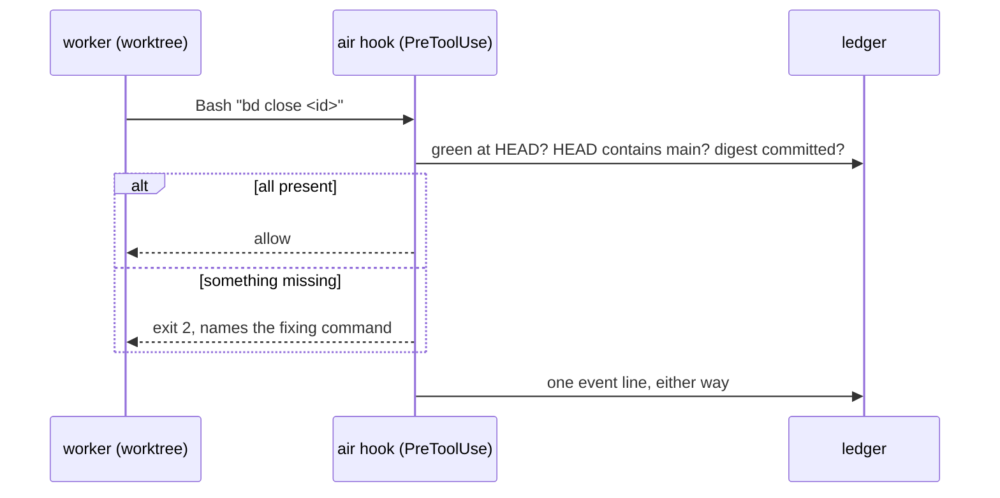

# Diagrams for a design doc

Which Mermaid form fits which subject, and how to keep each readable. All render natively in
GitHub, in the Artifact viewer and in most editors; no library is needed.

| Subject | Form | Use it for |
|---|---|---|
| The system and its neighbours | `flowchart LR` with `subgraph` boxes | the overview; one box per process or store, arrows labelled with what crosses them |
| One path through the system | `sequenceDiagram` | a command, a hook call, a landing; participants are processes or roles, not files |
| A thing with states | `stateDiagram-v2` | a session, a claim, a lease, a bead as Air sees it |
| Stores and their relations | `erDiagram` | the ledger's tables; attributes only where they carry meaning |
| A decision the code makes | `flowchart TD` | a gate: the facts read, the branches, the outcomes |

## Conventions

- An arrow is a call, a write, or a message. Its label says which, in two or three words:
  `records verify_runs`, `SendMessage`, `bd update --claim`.
- One diagram, one subject. If a diagram needs a legend, split it.
- Fewer than twelve nodes. Past that the reader is parsing, not seeing.
- Name nodes the way the glossary names them. A node called "verification lane" in one diagram and
  "w4" in another is two things to the reader.
- Show refusals and recorded facts on the sequence diagram as notes or `alt` blocks, because
  they are the part the prose cannot show as well.
- The prose after a diagram explains ownership, guarantees and why; it does not narrate the
  arrows again.

## Example: a sequence with a refusal and a recorded fact

