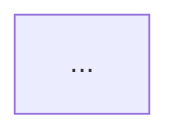

# Template

Copy this skeleton. The italic line under each heading is the question the section answers;
delete it once the section is written.

```markdown
# <System> design

<Two sentences: what the system is and what it is for.>

Describes: commit `<sha>`, `<binary> <version>`, on <date>. Numbers in this document were
produced by the commands shown beside them on that date.

## 1. Context and goals

*What problem exists, who has it, and what this system does about it. Then, as a short
list, what it deliberately does not do.*

## 2. Overview

*One diagram of the system and everything it touches. Then one paragraph per box: what it
is and what it exchanges with its neighbours.*



## 3. Components

*One subsection per component. Responsibility in one sentence. What it owns. What it
depends on. Size (files, lines) so the reader can judge weight.*

### 3.1 <component>

## 4. Interfaces

*Every surface another party uses, grouped by that party. A table per surface: name, who
uses it, what it does, where it is implemented.*

### 4.1 <surface, for example the CLI>

## 5. Data

*Each store: what it holds, who writes it, who reads it, how long it is kept. A diagram of
the entities and their relationships.*

```mermaid
erDiagram
  ...
```

## 6. Flows

*One sequence diagram per main path through the system, with the facts recorded and the
refusals possible along the way. A paragraph after each on what the diagram cannot show.*

### 6.1 <flow>

```mermaid
sequenceDiagram
  ...
```

## 7. Invariants and guarantees

*A table: what is always true, what enforces it, and how a violation would be seen.*

## 8. Failure model

*For each dependency and each internal part: what happens when it is slow, absent, or wrong.
Say which failures are open (the system proceeds) and which are closed (it refuses), and why.*

## 9. Operations

*Install, launch, upgrade, observe. What a release is and what changes it.*

## 10. TODO

*The one explicit list of what is still to do: one line per item, dated, pointing at where
the detail lives. Bead id on the line once filed; delete the line when it lands.*

## 11. Glossary

*One line per term used in a specific sense.*
```
