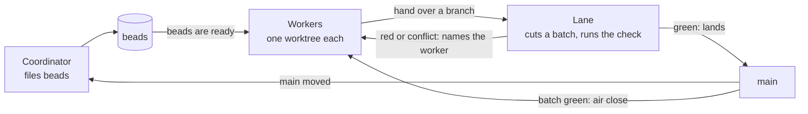

<p align="center">
  
</p>

Multi-agent accountability and verification system. Lighter than air.

## Philosophy

Do less. Most agentic systems try to do too much. The models knows how to do the work and they keep
getting better at doing it. Our goals are practical: transform objectives into tasks, create a merge queue, spin up multiple sessions to work, and help keep the fleet of sessions running.

## The roles

A fleet is three kinds of sessions. Each is a full Claude Code harness (support for other harnesses incoming), and each has one job.

- **Coordinator** (`air coordinator`). The session you talk to. It turns what you want into beads, sets priorities, and starts the other sessions. It does not write the code. Keeping it free of implementation work means it is always available to you.
- **Workers** (`air worker`). Each takes one bead at a time, does it in its own git worktree, and closes it with proof. Separate worktrees mean workers never edit each other's files. The default amount of workers is three, because the returns from more parallel harnesses falls off quickly beyond that.
- **Verification lane** (`air lane`). It merges finished branches into a batch, runs your tests suite/validation checks... once for the whole batch, and lands the batch on `main`. It is the only session that moves `main`. Checking once per batch costs far less than once per branch, and a single owner of `main` means `main` only ever moves to a commit that passed.

## How it works



Air sends the messages on the arrows; nobody polls and nobody relays. The lane is the only
thing that moves main.

The sessions can also message each other directly, and sometimes that is the right way to
coordinate. Air's aim is to make it rarely necessary: when the facts arrive on their own, the
fleet spends its time on the work instead of on talking.

## What Air is

- **A merge queue.** Workers finish branches, and a verification lane merges them into one batch
  and lands it on `main`.
  - Your project defines the check: one command that exits 0 when the project is good, usually
    your tests. For example `make verify`.
  - The lane runs it once per batch, and Air records which commit passed.
  - A bead closes only on a passing run.
- **Sessions.** Air starts the coordinator, the workers and the lane, each in its own git
  worktree and tmux session.
- **Decomposition.** A skill, installed into every project, for breaking work into epics and
  beads a worker can finish on its own.
- **Shared resources.** Leases for anything one agent can use at a time, such as a port or a
  simulator.
- **Keeping the fleet moving.**
  - The coordinator is told when a worker goes idle, silent or away while holding a bead, when a
    branch is ready to land, and when a lease is held by a session that has died.
  - A worker with nothing claimed is offered the beads that are ready.
  - Two workers editing the same file are warned.
  - `air status` shows when a session stopped, for example at an account limit, and what else is
    running in each worktree.
  - Sessions set a recurring wake so they pick up again after a pause.

Air supports Claude Code only, for now.

## How to install it

Needs git, Rust, tmux, Claude Code and [beads](https://github.com/gastownhall/beads) (`bd` 1.3.0).

```sh
cargo install --path crates/cli     # from a checkout of this repository
cd /path/to/your/repo
air init --write
```

`air init` finds your check (a Makefile `verify` or `test` target, `cargo test`, or `npm test`)
and prints the next steps: commit, run `air record verify --` with that check, and run `air
coordinator`. If it finds no check, it writes a `make verify` that fails until you fill it in. If
agents share a port or a device, list the commands that use it under `leases` in
`.claude/air.json`.

[examples/minimal](examples/minimal) is a three-file project after `air init`. It shows a check
and every file Air adds.

## How you use it

From your repo's main checkout, in a terminal:

```sh
air coordinator
```

That is the whole start. The coordinator asks whether to start the fleet; say yes, and Air
creates a worktree for each role, starts the beads server, and opens a tmux session for the
lane and each worker with the roles text and the channel attached. Then you talk to the
coordinator: say what you want built. It files the work as beads, the workers claim them, the
lane verifies and lands them, and the notices keep everyone moving. You check the results, and
you can attach to any session (`tmux attach -t <project>-worker-1`) and type into it.

`air status` shows the whole fleet on one screen. `air fleet stop` pauses all work with one
command, and `air fleet resume` restarts it.

## The pieces

Air is one Rust binary, `air`, plus the files it keeps in `.air/`.

- **Launchers.** `air coordinator`, `air worker` and `air lane` start sessions in their worktrees.
- **Ledger.** One SQLite file with claims, verification runs, leases and landings, plus a daily
  event log.
- **Hook.** `air hook` runs on every tool call. It keeps a worker's edits in its worktree and
  refuses a close that has no passing run.
- **Channel.** `air mcp` tells the coordinator when something needs attention.
- **Merge queue.** `air record`, `air batch cut` and `air land`.
- **Diagnostics.**
  - `air status` shows the whole fleet on one screen.
  - `air audit` shows how often each rule fired, so rules that never fire can be removed.
  - `air doctor` checks the install and the pinned beads version.
  - `air selftest` proves every check can fail and pass.

## Upcoming

- Support for [Pi](https://github.com/earendil-works/pi) and other open-source harnesses.
- Fleets spread across several machines, with every agent still working through Air.

## Inspired by

- [Gas Town](https://github.com/gastownhall/gastown): the batch-then-bisect merge queue, and
  checking a heartbeat against the real process.
- [beads](https://github.com/gastownhall/beads): the task store Air works beside.
- [Symphony](https://github.com/openai/symphony): isolated runs per piece of work.
- [bors-ng](https://github.com/bors-ng/bors-ng), [homu](https://github.com/rust-lang/homu) and
  [Zuul](https://opendev.org/zuul/zuul): merge queues that keep `main` on a tested tree.
- [Overstory](https://github.com/jayminwest/overstory): multi-agent orchestration with a merge
  step.
- [awesome-agent-orchestrators](https://github.com/andyrewlee/awesome-agent-orchestrators): the
  list Air was checked against.
- [Metis](https://github.com/colliery-io/metis): how to break work into epics and beads.

## How Air is tested

- `make verify` runs the unit tests and then `air selftest`: one probe per check Air makes,
  each shown failing without the check and passing with it
  ([crates/cli/src/cmd/selftest.rs](crates/cli/src/cmd/selftest.rs)).
- Before a release, a real fleet runs the [live trial](docs/design.md#91-the-live-trial): a
  coordinator, a lane and three workers work through nine scenarios on a copy of
  [examples/minimal](examples/minimal), from a fixed
  [request](scripts/trial/request.md). The coordinator writes a report of what happened,
  including every workaround, and [scripts/trial/count.py](scripts/trial/count.py) counts the
  messages and refusals the run needed.

## Docs

- [Design](docs/design.md): the whole system as it is today, kept current with the code.
- [Roles](docs/rules/roles.md): what each role does, shipped to adopters as `.air/roles.md`.
- [Adopting Air](docs/rules/adopting-air.md)

## Status

In use on two repositories. Commands still change between releases, and `air install` tells an
installed repository what changed.

## License

Apache-2.0. See [LICENSE](LICENSE).
