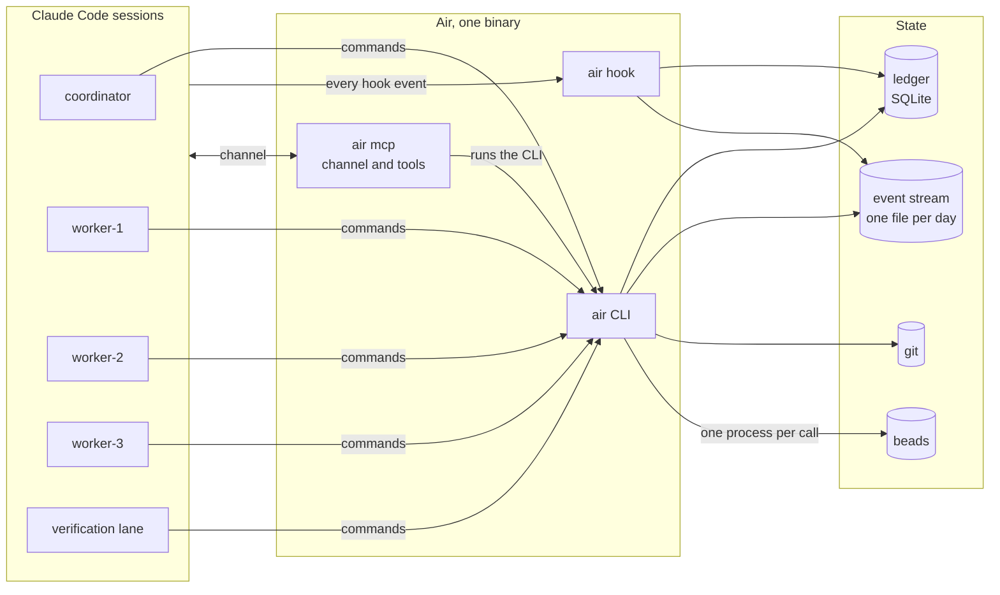
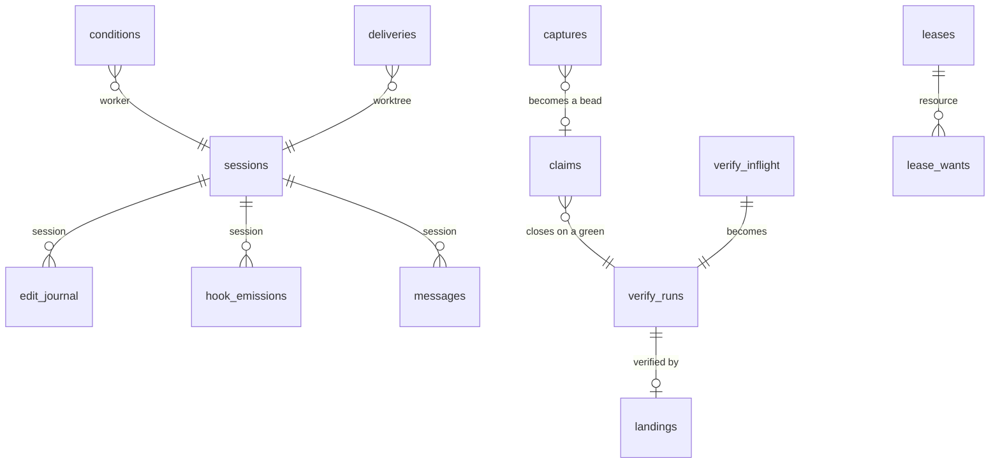
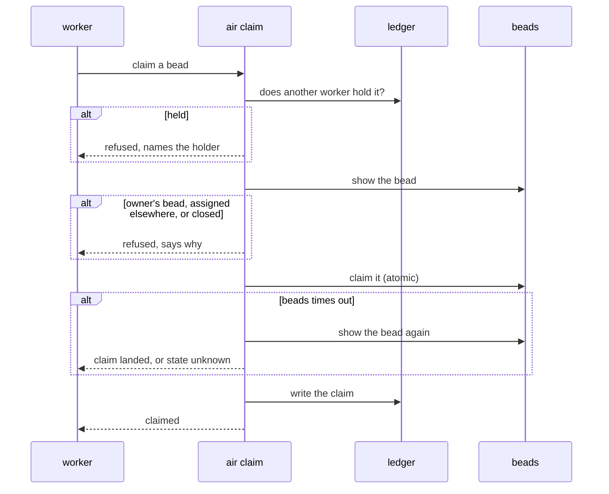
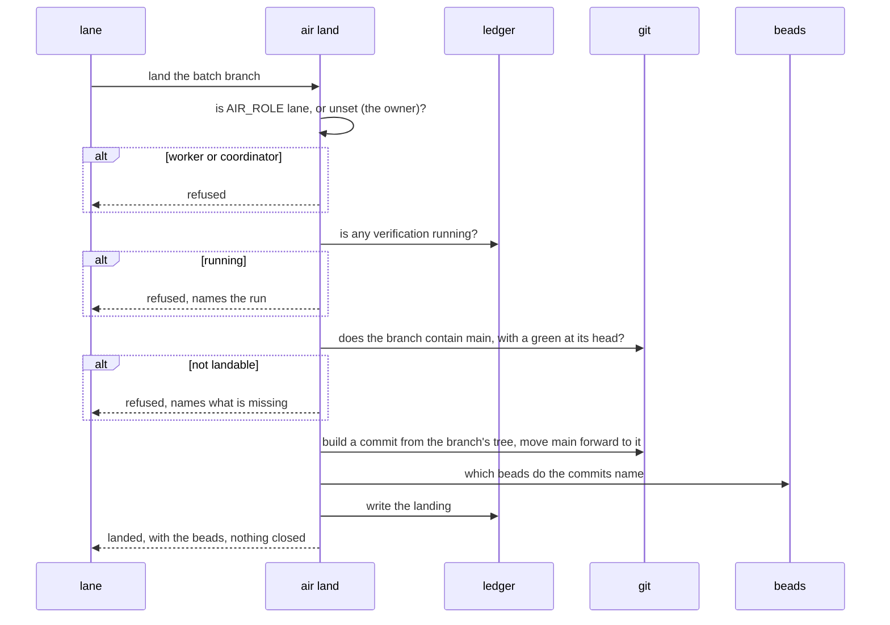
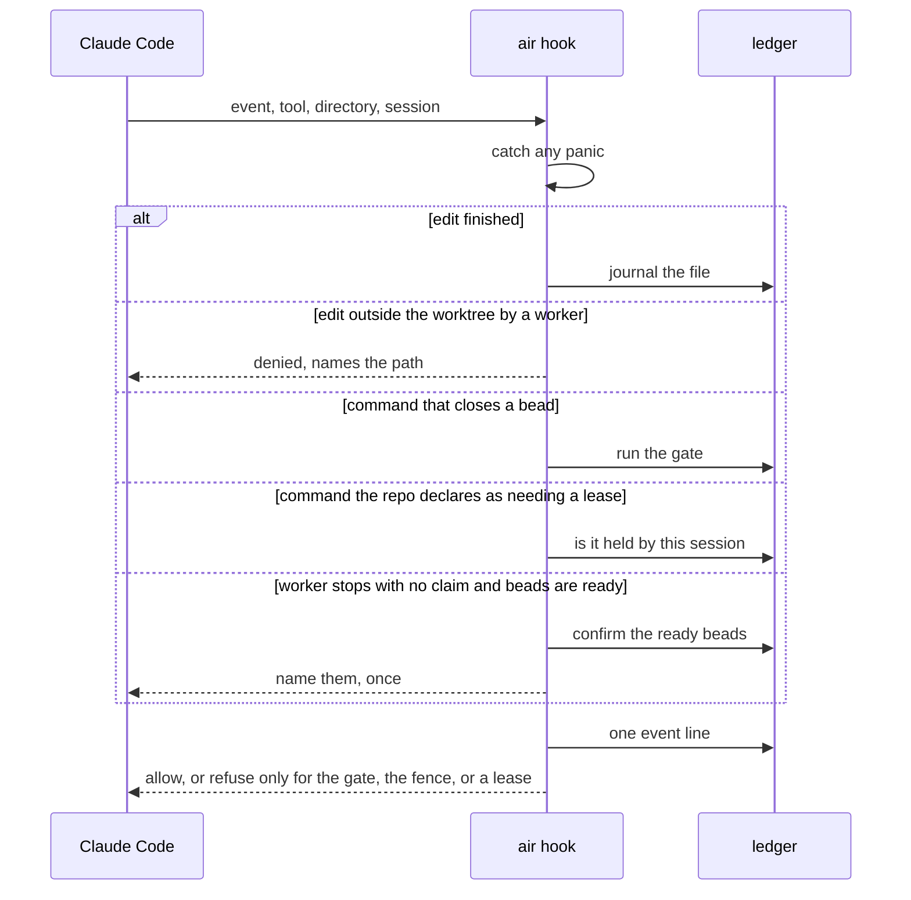
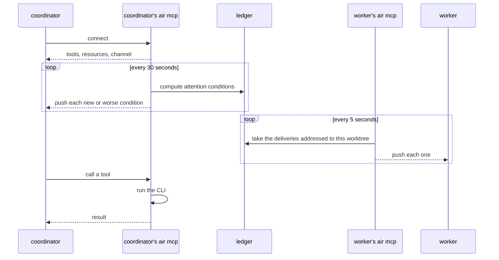
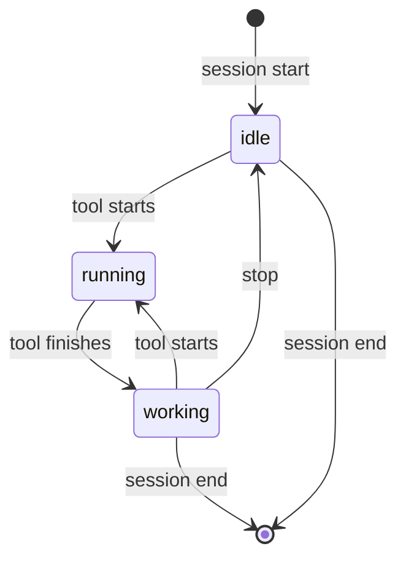

# Air design

Air is a single Rust binary that lets a few Claude Code agents work on one repository at the
same time. Each agent runs in its own git worktree. Air keeps the facts the agents would
otherwise pass around in chat. It knows which commit passed verification, who is editing which
file, who holds which task, and who holds a shared resource. It refuses exactly one thing:
closing a task without a recorded green verification run at a commit that contains main.

This document describes branch fleet-protocol-in-air on 2026-09-25, version 0.3.5 with 19
notices not yet released. The crate sizes, command and tool lists, probe count and notice count
were re-derived from that tree the same day; figures carrying an earlier date are from that
date. On 2026-09-25 this also became the one design record: the proposals that were in
docs/plans became TODO lines in section 10, and the research in docs/research became the
technology decisions in section 11.

## 1. Context and goals

A fleet is five sessions: three workers, a verification lane, and the coordinator. Each lives in
its own worktree on its own branch, and nobody works in the main checkout. All five share one
task store, called beads, and one main branch.

Without a shared record, agents relay facts from memory. One says its branch is green, another
says nobody is in a file. Those relays drift, and most of the incidents
Air has recorded trace back to that drift. Air holds the facts where every session can read them. It answers
questions about them quickly enough to run inside an editor hook. Everything it produces is a
fact or an answer, apart from the one refusal. The owner can watch and type into every session,
and nothing Air launches runs headless.

Air does not choose or split the work. It does not review code. It does not run verification
itself; it runs the repository's own command and records the result. It does not replace beads
or Claude Code, and it never pushes, deploys, or publishes.

## 2. Overview



The sessions are ordinary interactive Claude Code processes. Air starts each one with a role, a
list of commands it may not run, and a few environment variables. Sessions reach Air in three
ways. They run air commands from their shell. Claude Code calls the air hook on every tool call
and lifecycle event, which is how Air sees edits and session changes. Every session Air starts
also has Air attached as a channel. Through it the coordinator receives the conditions that need
attention, and each session receives the messages Air addresses to it, without anyone polling.

All three entry points are the same binary, and they write to the same two stores in the main
checkout. The ledger holds current state and the event stream holds history. Air reads git and
beads through their own commands and never copies them. It records only what those two cannot
reconstruct.

## 3. Components

The workspace has four crates. Line counts are from 2026-09-25.

| Crate | Lines | What it does |
|---|---|---|
| ledger | 3,559 | The SQLite schema, one row type per table, and the event writer. It makes no network calls and never calls beads. |
| hooks | 1,361 | The hook input and output types, the hand-over gate, the edit journal, the worktree fence, and the nudge a claimless worker gets when it stops. The gate is a pure function of a set of facts, so it can be tested without git or a clock. |
| bd | 544 | A wrapper over the beads command line: list ready work, show, claim, set status, comment, close. It also counts time spent waiting on beads. |
| cli | 38,243 | Every command, the hook entry point, the channel server, the launchers, install and init, status and its attention conditions, landing, audit, and the self-test. The self-test file alone is 13,670 lines. |

The ledger is one SQLite file under .air in the main checkout, shared by every worktree. A row
stays until the thing it describes stops being true, and nothing expires on a timer. Beside it,
the event stream gets one line per command and per hook call. Each line says what Air was asked,
what it decided, why, and what it looked at.

The hook reads Claude Code's JSON from standard input and must finish within the five second
timeout the installer sets. It fails open. Any error or panic lets the tool call proceed and
writes an event line saying what happened. The hook never calls beads, with one exception: the
stop nudge checks its cached list of ready beads against beads before naming one.

Each command lives in its own source file, with a header naming the incident it exists for and
when it should be removed. Every command writes one event line and can print JSON. The channel
server runs the CLI with JSON output, so the two can never disagree.

The channel server is a small synchronous JSON-RPC server over standard input. Claude Code
starts one per session, in the session's directory, so each server knows which worktree it
serves. In the coordinator's session and the owner's, every 30 seconds it re-reads the attention
conditions from the ledger and pushes any that are new or worse. In every session a launcher
attached it to (the launcher sets AIR_CHANNEL=1), every 5 seconds it takes the rows of the
deliveries table addressed to its worktree, pushes each into the session, and marks it
delivered. A server the session did not load as a channel delivers nothing, because Claude Code
drops its notifications without an error. It lives as long as its session, so it limits line
length, puts a time limit on every child process, catches panics per request, and exits cleanly
when its input closes.

The worker launcher creates a worktree under .claude/worktrees on its own branch. It copies in
the ignored files the repository lists, such as environment files. It writes any first task to a
file rather than the command line, then starts Claude Code in the worktree with the role prose,
the deny list, and the role's environment. Given a task or the tmux option, it starts a tmux
session named after the project and the worker, detached when there is no terminal. Given
neither, it runs Claude Code directly in the caller's terminal. Every launch attaches the Air
channel. The lane launcher is the worker launcher with the lane's role. The coordinator launcher
does the same in its own worktree, coordinator, always in a tmux session; run again,
it attaches to the session already running. Nothing is launched in the main checkout. The
channel server comes from the tracked .mcp.json, so it is present in every worktree, and the
ledger resolves to the main checkout's .air from any of them. Every launch approves that server
in its own settings, so no session stops to ask whether to use it. Two start-up prompts
remain, because Claude Code has no supported way to answer them: the folder-trust question,
asked until the main checkout is trusted once, and the development-channels warning each
session shows because it loads the Air channel. The coordinator launcher and air fleet up say
once which to expect and the answer.

Names carry the role and the project. Worktrees are worker-1, worker-2 and so on, lane, and
coordinator, each on a branch named worktree- and the worktree's name. The tmux session and the
Claude Code session name, which is what ListAgents shows and SendMessage addresses, are both the
project and the worktree name, as in air-worker-1. The project is the project key in
.claude/air.json, else the beads prefix, else the main checkout's directory name. A launch
whose tmux session name already exists in another directory is refused, naming that directory,
since it belongs to another checkout. One that exists in the same directory is the same role's
session and is attached to. A name grants nothing: the role reads from a name only for display
and for which branches a scan considers, and a legacy w1 reads as a worker.

### 3.1 Roles and permissions

Every permission comes from the AIR_ROLE environment variable, which only the launchers set.
The worker launcher sets it to worker, the lane launcher to lane, and the coordinator launcher
to coordinator. A shell Air did not start has no role, and Air treats it as the owner, who may
do anything. A value Air does not recognise counts as a worker.

The lane is a worker with one permission added and one piece of advice removed. It may run air
land, which is refused to workers and, since the owner's ruling of 2026-09-14, to the
coordinator; the owner may still land. The stop hook offers it no ready bead and gives it no
hand-over advice, since its branch carries every member's beads. Every other check that stops
a worker stops the lane: the edit fence, the refusal of air close and of claiming a bead the
owner must decide, releasing another worker's claim, and the UNENFORCED mark in status.

The directory a command runs in never decides what it may do. Neither does the repository path
passed on the command line. The coordinator can therefore move into a worktree and keep every
permission it has. The directory still names things, such as which worktree a verification run
belongs to, but it grants nothing.

Workers are kept from a small set of commands in two ways. Claude Code's deny list stops them
from running the commands at all. For air land and air close, Air's own checks refuse again when
AIR_ROLE is worker or lane, which covers the command being spelled a different way. The lane's
deny list is the worker's without air land, and a worker's includes air lane and air fleet.
The lane's settings also carry an allow rule for air land (and for the pinned binary's path
when the repository is pinned). In auto mode an allow rule resolves before the classifier
runs, and without it the classifier refused the lane's landing in the 0.4.0 trial. The rule
is on the lane's command line, not in the repository's settings, so no other role gets it.

## 4. Interfaces

### 4.1 Commands

Any session may run these.

| Command | What it does |
|---|---|
| air record | Runs a check command and records the worker, the commit, the exit code, the duration, the output size, and whether the tree was dirty. It refuses a backgrounded command. A check killed by a signal counts as no verdict, not as a failure. The kinds are verify, docs-check, fitness and precheck; a precheck is a worker's cheap check under a lane and is never read as a verify green. A verify at a batch head tells each member the result and ends with the lane's next step. |
| air handover | Says what the gate would decide about this worktree right now, and which command would fix anything missing. |
| air claim | The only way to claim a bead. It refuses while the fleet is stopped. It checks the ledger, asks beads about the bead, claims it in beads, then writes the ledger row. If beads times out, Air reads the bead again instead of guessing. |
| air release | Returns a bead in progress to open. It never reopens a closed bead. The coordinator can release a claim held by a worker that has gone. |
| air capture | Puts one item in the coordinator's inbox. It never blocks. |
| air holdings | Shows who has edits in which files across all worktrees. |
| air lease | Takes, releases, or reports a named shared resource such as a port. The holder is identified by worktree and process. `air lease needs "<cmd>"` says which lease a command needs, per `leases` in `.claude/air.json`; the PreToolUse hook refuses such a command from a worker not holding it. |
| air status | The one screen: sessions, claims, greens, overlapping edits, inbox, branches ready to batch, checks running (each named by its kind), what else is running in each tree (every process that is not a Claude Code session with its working directory in a worktree or the main checkout, by name and age, or `unknown` with why), a warning naming any launched session whose process runs in the main checkout (the owner's own shell is exempt; nothing is refused), and whether the install is out of date. |
| air batch cut | The verification lane's cut, run in its worktree and refused in the main checkout or on a tree with uncommitted changes. It takes the branches ready for a batch, oldest ready first by the commit time of each listed head, and checks each against main and against each earlier accepted branch with git merge-tree, which writes nothing. A branch that conflicts is dropped, named with the other side and the paths, and written to the event stream. Then it merges main and each remaining branch at its listed commit into the lane's branch, judging each merge by the index and by leftover conflict markers, not by git's output. It needs git 2.38 or later. With dry run it only checks. It tells each dropped worker its conflict, and it refuses while the fleet is stopped. It neither verifies nor lands; it prints the next command. |
| air doctor | Reports where the ledger is, its size and schema version, whether beads is the pinned version, and beads' mode (embedded, or server with its port and whether it answers). |
| air bd-server up, air bd-server status | For a project whose beads runs in server mode, up starts the Dolt server when its port does not answer and waits up to 10 seconds for it; status prints the mode and whether the port answers. Neither touches a project whose beads is embedded. |
| air audit | For each mechanism Air ships, how often it fired, over what, when last, and its removal condition. It gives facts, not verdicts. |
| air selftest | Runs a red and a green probe for every check. There were 162 probes on 2026-09-25. |
| air gc | Reports how much of the event stream a retention period would remove, and removes it only when told to. |

These belong to the coordinator, the lane, or the owner. Claude Code's deny list keeps workers
from air land, air close, and the three launchers, and Air refuses land and close again by role.
Nothing refuses inbox, triage, install or init to a worker.

| Command | What it does |
|---|---|
| air inbox | Lists open captures, oldest first. |
| air triage | Resolves one capture, either by linking the bead the coordinator filed or by dropping it with a reason. |
| air land | Refused to every launched role but the lane; the owner may run it. Builds a commit from the branch's tree on top of main and moves main forward to it. It refuses unless the branch contains main and has a green at its head, and it refuses while any verification is running. Before moving main it warns, without refusing, about every process that is not a session with its working directory in the main checkout, by pid. It records the beads the branch's commits name. A range that names no bead is refused unless its commits are all session-journal entries or all the coordinator's (the non-merge commits of the coordinator worktree's branch), and then it lands recording no bead. It closes nothing, and it always updates main in the main checkout, wherever it is run from. It refuses while the fleet is stopped, tells each member that its commits landed, and ends with the branches batch-ready now and the next command. |
| air close | Closes beads that have already landed, in one beads process, and releases their claims. |
| air worker | Starts a worker session, or prints the command it would run and writes nothing. It refuses, naming the files, while air install's output is uncommitted in the main checkout, since a new worktree gets only committed files. It can also remove a worktree, but not while the worktree has uncommitted work or a live session. |
| air lane | Starts the verification lane: a worker session in the lane worktree with AIR_ROLE lane and the worker deny list without air land. It refuses and prints as air worker does. |
| air coordinator | Starts the coordinator session. First it asks on the terminal whether to start the fleet as air fleet up does; its fleet flags answer in advance, and with no terminal the answer is no. |
| air fleet up | Starts beads' server if it is down (as air bd-server up), then the lane and the configured number of workers (three by default, from the workers key), each in its worktree and a detached tmux session, leaving any already running. Workers get no first prompt; the lane gets a fixed one to start its loop. |
| air fleet stop, air fleet resume | The coordinator's and the owner's only; a worker or the lane is refused. Stop sets a fleet-wide stop in the ledger with its time, author and reason, and tells every other worktree's session. While it holds, air claim, air batch cut and air land refuse naming it, the ready fan-out and the stop nudge are silent, and air status leads with it. No session is killed, and a verify already running finishes and is recorded. Resume removes it and tells every session. |
| air install | Adds the hooks and the channel server to the repository's Claude Code settings and writes the role prose and the air-* skills, removing any air-* skill it once installed and no longer ships. It shows the change first and writes only when told to. It refuses when the air on the path is a different binary, when .air is not ignored by git, or when the repository was installed by a newer version. With --pin it copies itself to .air/bin/air, points the hooks and the channel at the copy, and the launchers put .air/bin first on the path of every session they start; the path check does not apply then. In a pinned repository any other air hands every command but install to the pin before running it (air-qyrm). --unpin goes back to the path. |
| air init | Sets up a new repository: checks for beads and Claude Code (and Dolt and tmux when there is no .beads yet), initialises git, starts a Dolt server on a free port and initialises beads in server mode against it, moving the port from the tracked metadata.json into .beads/dolt-server.port (the bead prefix is the directory name unless given), writes the ignore file and Air's config (the directory name as `project`, Metis on only when installed), then installs. It proposes the verify command the repository already has (a Makefile `verify` or `test` target, `cargo test`, `npm test`) and writes a failing `make verify` placeholder only when it finds none. |

Two hidden commands, release-check and adopter-check, are run by the Makefile. Claude Code
itself starts air mcp and air hook.

For a sense of real use, here are the counts from an adopter's event stream over 17 days of
rounds, from 2026-08-21 to 2026-09-13. Status ran 4,265 times, claim 1,208, triage 924, capture
842, record 838, handover 506, land 222, holdings 173, lease 122, release 71, close 59, and audit
3. There were also about 148,000 hook events and 44,769 channel polls. This repository's own
counts are not a guide, because Air has mostly been built here rather than used. Usage is one
signal for the audit in section 10, not the verdict.

Every decision Air makes is measured by air audit. Each event line's command and decision is a
constant in `cmd/decisions.rs`, and the event writer accepts nothing else. Each registry row in
`cmd/mechanisms.rs` names the lines it counts, or the timing budgets whose hits it counts, with
the failure it prevents and its removal condition. Where none was recorded, the audit reports
that as a defect. A self-test probe fails when a decision that is not bookkeeping, or a budget,
has no row, so a new mechanism cannot ship uncounted. The audit prints every row, zeros
included, with what it counts (air-hqj8).

air audit also prints worker-to-coordinator messages per closed bead, from the `messages` and
`claims` tables. The baseline is the 2026-09-26 trial, where workers messaged the coordinator on
every close: 5 messages to the coordinator by name and 11 to an unnamed `uds:` socket over 6
closed beads, so 0.83 to 2.67 per close. The next round runs under roles.md without the
signal-on-close rule and is compared against that number (air-uzh2).

### 4.2 Channel tools, resources, and conditions

The channel server lists 10 tools and 5 resources. The tools cover status, attention, holdings,
hand-over, claim, release, capture, inbox, triage, and close. The resources cover status,
attention, inbox, holdings, and leases. Every one of them runs the CLI. The server also answers
three lease tools (take, release, status) that it does not list, so no client discovers them.

The channel pushes eleven attention conditions. Each is computed by air status from the ledger,
git, the clock, and a set of thresholds.

| Condition | Meaning |
|---|---|
| idle with claim | A worker holds a bead and has been idle past the threshold. |
| silent with claim | A worker holds a bead and its session has written nothing for a while. |
| gone with claim | A worker holds a bead and its process has gone. |
| idle without claim | A worker is idle with nothing claimed while beads are ready, no check of its own (verify or precheck) is running, and no process other than its session is running in its worktree. |
| handover not green | Someone tried to close a bead without the green the gate wants. |
| landed not closed | A bead's commits are on main but the bead is still open. |
| closed not landed | A bead is closed but its commits are only in one worktree's branch. |
| rewound and carried | A merge that was rewound off main is still carried by a worker's branch. This is history only; no new rewind can happen. |
| landable | A branch is green and contains main. |
| lease held by dead session | A shared resource is held by a process that has gone. |
| lease stale | A shared resource's holder has not refreshed it in time. |

### 4.3 Hook events

Installing Air registers the hook on eleven Claude Code events, each with a five second
timeout.

| Event | What happens |
|---|---|
| Session start and end | The session's row is created, idle, or removed. |
| Before a tool runs | For an edit, Air warns if another worker is editing the same file. If the session's role is worker or lane and the file is outside its worktree, the edit is denied. For a shell command that closes a bead, the gate runs; it refuses only when enforcement is on, which the worker and lane launchers turn on. A command the repository declares as needing a lease is refused, under the same switch, to a session not holding it. For a message to another agent, Air records the message and its content. |
| After a tool runs | The edited file goes in the journal and the session is marked working. |
| Tool failure, permission request, permission denied, notification, stop failure | The session's state is updated and an event line is written. |
| Stop and subagent stop | For a worker, Air adds the gate's verdict when something is missing, and nudges a worker with no claim once, naming ready beads it has confirmed. The lane and the coordinator get neither, by AIR_ROLE. |

Every hook call, including the silent ones, writes one event line.

### 4.4 Files and environment

| Path | Purpose |
|---|---|
| .air/ledger.db and .air/events | The ledger and the event stream. Both must be ignored by git. |
| .air/roles.md | The role prose built into the binary, which every session receives. |
| .air/installed.json | The version and notices this repository has been installed with. |
| .air/ready.json | A cached list of ready beads, used by the stop nudge. |
| .air/tasks | A worker's first task, kept off the command line. |
| .air/journal | One session journal per file, written from any worktree (the fence allows it). Default location unless `journal_dir` names one in the tree. Nothing reads it. |
| .air/digests | The digests the close gate reads when `.claude/air.json` says `"digests": true`: a file declaring `bead: <id>`, checked for existence, written from any worktree. |
| .claude/air.json | The repository's config: the project name for machine-wide names (`project`), extra deny patterns for each role, which commands need which lease (`leases`), the verification lane's name, whether batch-ready wants a green precheck (`precheck`), how greens are matched, whether a close needs a digest (`"digests": true` for `.air/digests/`, or a tracked `digest_dir`; neither means none), an optional tracked `journal_dir`, and whether Metis is attached. |
| .claude/settings.json and .mcp.json | The hook entries and the channel server entry, merged in by install. |
| .claude/worktrees | One worktree per session: each worker, the lane, and the coordinator. |
| .air/dolt | beads' Dolt server when beads runs in server mode: the data in `data/`, the server's output in `server.log`. The server runs in the tmux session `<project>-dolt`. |
| .beads/metadata.json, .beads/dolt-server.port | beads' own files, which Air reads: `dolt_mode` says server or embedded, and the port file (gitignored by beads) holds the server's port. |
| .worktreeinclude | Ignored files to copy into new worktrees. |

The launchers set four variables on each session. AIR_ROLE is the role. BEADS_ACTOR is the
worker's name, AIR_PROJECT is the project, and AIR_ENFORCE turns the gate from advice into a
refusal for workers and the lane. Other variables override where Air finds Claude Code, beads, and tmux, and
change its timeouts and polling interval.

This is the worker launch, as the launcher prints it for a worker named worker-9 in this
repository:

```
AIR_ROLE=worker BEADS_ACTOR=worker-9 AIR_ENFORCE=1 AIR_PROJECT=air AIR_CHANNEL=1 claude
  --append-system-prompt-file .air/roles.md
  --settings '{"env":{...},"enabledMcpjsonServers":["air"]}'
  --name air-worker-9
  --dangerously-load-development-channels server:air
  --disallowed-tools 'Bash(air land *)' 'Bash(air close *)' 'Bash(git push *)'
    'Bash(bd create *)' 'Bash(bd sync *)' 'Bash(bd update *--claim*)' 'Bash(claude *)'
    'Bash(air worker *)' 'Bash(air coordinator *)' 'Bash(air lane *)' 'Bash(air fleet *)'
    EnterWorktree ExitWorktree AskUserQuestion
```

The repository's own worker_deny patterns follow the list. The lane's launch is the same with
AIR_ROLE lane, without the air land deny, and with `"permissions":{"allow":["Bash(air land
*)"]}` in its settings. The coordinator launch attaches the channel the same way and denies git
push plus the repository's coordinator_deny patterns.

## 5. Data



| Table | Holds | Written by |
|---|---|---|
| verify runs | One row per recorded check, with the commit, exit code, command, duration, dirty flag, tree, and batch members. | record and land |
| verify in flight | The check currently running and its process. | record |
| edit journal | Which worker touched which file, and when. | the hook |
| claims | Which worker holds which bead, the files it declared, and when it let go. | claim, release, close, the gate |
| sessions | Each session's worker name, role, and state. | the hook |
| landings | Each landing attempt, its result, the beads it carried, and the commit it made. | land |
| captures | Inbox items and what became of them. | capture and triage |
| leases and lease wants | Who holds each shared resource and who is waiting. | lease and the hook |
| hook emissions, conditions, bd cache | What a hook last said in each session, attention conditions with their first and cleared times, and small cached beads answers. | the hook, status, commands that call beads |
| messages | Every message one agent sent another, with its content. | the hook |
| fleet stop | One row while the fleet is stopped: when, by whom, and why. | fleet stop, fleet resume |
| deliveries | Every message Air addressed to a session: the worktree it is for, its kind, the change it names (unique per worktree and kind), its text, when it was queued and when the channel pushed it. | the commands and the coordinator's channel that notice the change; the recipient's channel marks it delivered |

On 2026-09-14 this repository's ledger held 214 claims, 157 landings, 145 captures, and 1,176
conditions. Ledger rows never expire. Event files are removed only when the owner runs air gc
with its apply option, and never while the ledger still points at them.

## 6. Flows

### 6.1 Claiming a bead



Air asks the ledger first because it is local and cheap. Beads decides races, because its claim
is the only atomic write. A timeout leaves the state unknown, so Air reads the bead again
instead of trying the claim twice.

### 6.2 Closing a bead, the one refusal


A green means a successful recorded run at the exact commit, or, if the repository matches by
tree, at any commit with the same tree. When a verification lane runs, the lane's green at a
batch commit that contains both the worker's commit and main also counts. That lets workers
close without running verification themselves. A commit made after the batch was cut is refused,
and the refusal names it. A branch is ready for a batch when it is not landable on its own and
names a bead its worker holds, or, for the coordinator's branch, has any commit main lacks; it
does not have to contain main, because the lane merges main
in when it cuts the batch.

The lane cuts with air batch cut, then records its verification at the new head. Which of two
conflicting branches is dropped is decided by the order rule, oldest ready first, and never by
the order anyone typed. The dropped branch's worker resolves the conflict in its own worktree.

### 6.3 Landing a branch



Main never moves to a commit whose tree was not verified. The landing commit has exactly the
tree the green describes, so there is nothing to re-verify and nothing to roll back. The worker
closes its own bead, before or after the landing. If a bead stays open once its commits are on
main, the landed not closed condition names it.

### 6.4 A hook call



The target is about a tenth of a second per call, so anything slow lives in the CLI instead. If
Claude Code kills a hook at the five second limit, the hook writes nothing. That is why air
audit also counts hook events that have no matching follow-up.

### 6.5 The channel



Claude Code queues channel events that arrive while a session is busy and hands them over
together on its next turn, so a push never interrupts a tool call. Each delivery writes one
channel.deliver event line with how long the message waited.

Deliveries are queued by whatever notices the change. After each 30-second tick, the
coordinator's server compares the claimable ready list with the one it saw last (asking beads
again when the cached list is more than a minute old) and, when a bead was added, queues
"beads are ready" for every worker with a live session holding no claim, whatever its state; one
mid-turn reads it after that turn. The lane and a worker holding a claim are never told. A later list replaces a worker's undelivered one, so a session that was
away hears the latest. The first tick after the server starts only records the list. One
fanout event line records each change and who was told.

The lane and its members are told the same way. The coordinator's tick queues "batch-ready"
for the lane once per branch head. air batch cut queues "dropped from batch" for each worker it
drops, air record queues each member's result when the lane records a batch verify (close on a
green, the exit and the kept output on a red, nothing on a kill), and air land queues "main
moved to <sha>: landed <beads>; files changed: <paths>" once per landing for every worktree's
session except the main checkout, the lane and the session that ran it. A member's copy also
says its beads may be closed, so a member gets one landing message. It asks for no reply
(fanout.rs, main_moved; air-1vri.4). The coordinator gets two notices of its own. air capture
queues "capture from <worker>: <first line>" for it once per capture, unless the capture was
written in the coordinator's or the main checkout. The tick queues "the ready queue is empty:
<n> worker(s) idle; epics with no open child: <ids or none>" when the claimable set is empty
and a worker holds no claim. A bd cache row records that it was sent and is cleared when the
set has a bead again, so it goes once per emptying. The epics are asked of bd only when it is
about to be sent (fanout.rs, capture_to_coordinator and queue_empty; air-1vri.5). air land and a
red batch's air record end with the branches
batch-ready now and the next command, or with "nothing is batch-ready", and when the lane ran
the command that output counts as telling it. air status prints two loop times from these rows
for the last 24 hours: from batch-ready to the start of the batch verify that took the branch,
and from "batch green" to the member's close. The 5-minute wakes stay as the backstop for a
push that is missed.

The coordinator's tick first checks beads' server when beads runs in server mode: a TCP connect
to its port. When nothing answers it starts the server as air bd-server up does, waiting up to
10 seconds, and queues one notice for the coordinator: "bd server was down; restarted it", or
"could not restart it: <why>". A bd cache row makes the second kind once per outage; Air keeps
trying on each tick and says nothing more until the server answers (bd_server.rs, keep_alive).

air lease release and air lease break queue "<lease> is free" for each worker the lease_wants
table records as waiting, oldest first. Delivering it removes that worker's want, and taking
the lease removes it too.

### 6.6 Session states



A session starts idle: one launched with no task takes no turn and never stops, so recording it
working made a fresh worker look busy for good (the 2026-09-26 trial stalled at three ready
beads). A start caused by compaction, which happens mid-turn, keeps the state it found.

Status adds two more states. A session is gone when its process disappeared without ending, and
a worktree has no session when nothing has run there. A stuck state for sessions waiting on a
permission prompt used to exist. It was removed because, in auto mode, the permission request
event never arrives.

### 6.7 Timing budgets

Every wait Air takes records how long it lasted and whether it hit its limit, and air audit
prints the distribution. A call to beads gets sixty seconds, plus five seconds for each bead it
names when it names several (closing, showing, listing dependencies). One function computes that
for every such call, so air close and the acceptance read in air land share it. These limits
fail closed, meaning the command is refused and the caller is told, so they are generous on
purpose (owner, 2026-09-25): an adopter's beads cost about two seconds per call and two per bead.
Setting AIR_BD_TIMEOUT_MS replaces the whole limit with one flat figure, and a timeout names the
bead count, the limit and that variable. The check after a timed-out claim gets thirty seconds.

Two beads limits stay short because something above them is shorter. The status tick gets four
times beads' median cost, between two and eight seconds and flat whatever the bead count,
because air status serves the coordinator's status tools, which are cut off at twenty seconds; a
timeout there falls back to cached counts. The stop nudge gets three seconds because it runs
inside a hook that Claude Code kills at five.

Each MCP tool runs its air command as a subprocess with a limit of its own. Status, attention,
holdings, inbox, capture and the resources get twenty seconds. A tool whose command makes a
beads call at the full beads limit gets one more such limit than its command can spend, taken
from the same function the command uses, so the command's own timeout is the one the
coordinator reads: close gets two limits for its bead count (130 seconds for one bead), triage
and handover two, release three, claim seven. None may reach Claude Code's own limit on a tool call,
MCP_TOOL_TIMEOUT, five minutes by default (code.claude.com/docs/en/env-vars, read 2026-09-25):
every tool limit is capped ten seconds under it, which caps claim and a close of seventeen or
more beads at 290 seconds. The subprocess leads its own process group, and a timeout kills the
group, so no beads process outlives the call (air-se4n).

Three budgets fail open, because they sit on the hook path: git gets a second and a half, the
SQLite lock gets one second, and the hook itself gets five seconds. Claude Code enforces the last
one by killing the process, so hitting it leaves no trace except a hook event with no follow-up.
With the fleet running on 2026-09-06, git took 54 milliseconds at the median and 170 at the 99th
percentile. The SQLite lock waited at most 131 milliseconds with six writers.

## 7. Guarantees and failure model

| Always true | Enforced by | A violation shows up as |
|---|---|---|
| A bead closes only with a green at a commit that contains main and every commit naming the bead. | The gate, with enforcement on for workers. | A handover not green condition. |
| Main moves only forward, onto a commit whose tree has a green. | air land. | A commit on main with no verification run. |
| One worker holds a claim at a time. | The ledger check, then beads' atomic claim. | Two open claims for one bead. |
| A worker's edits stay inside its worktree. | The fence in the hook. | A denied edit in the event stream. |
| A worker runs a command the repo declares as needing a lease only while it holds that lease. | The lease gate in the hook, refusing for workers and advising the coordinator. | A lease-refuse or lease-would-refuse event. |
| Permissions come from AIR_ROLE and never from the directory or the repository path. | Every role check reads the role from the environment. | A self-test probe going red. |
| Workers cannot push, file beads, land, close, start sessions, or ask the owner a question directly. | Claude Code's deny list, backed by Air's role checks. | A permission denied event. |
| Every command and hook call leaves one event line. | Each command's logging and the hook's fail-open path. | A hook event with no follow-up. |
| A check that finds nothing says what it looked at. | A rule for every check, probed by the self-test. | A green with nothing examined. |
| Adopting repositories are told about every change that affects them. | A notice list, one release per round, and a release check. | The verify target failing. |

When something fails, Air behaves as follows. The hook fails open on any error and on the five
second kill, because it must never block the editor. The kill is silent, so it is measured by
unmatched events. A beads timeout during a claim is treated as unknown and the bead is read
again. A killed verification is recorded as no verdict.

When beads runs in server mode and its Dolt server is down, every beads command fails, and Air's
reads of beads fail the way they do when beads is absent. The launchers and air fleet up start
the server before any session, and the coordinator's poll restarts it within one tick and tells
the coordinator. Air never starts a server over a data directory that lacks the project's
database, because beads would then create an empty one.

Everything else fails closed and says why. Landing refuses while a verification runs, unless
the owner overrides it, and the override is counted. A worker is refused landing and closing
wherever it runs. A repository path outside this project is refused. Install refuses a downgrade, a .air directory that git does not
ignore, or a different air binary on the path.
Doctor and init refuse a missing or wrong version of beads.

The close gate is the only closed default an agent meets in normal work. Everything else is a
fact, advice, or a refusal that names the command to fix it.

## 8. Enforcement and judgement

Air enforces a short list. The deny list decides who may run what, and the role checks back it
up. Claims are atomic and their history is recorded. A shared resource has one live holder.
Closing a bead needs a green, main merged, a claim, and a digest where the repo asks for one. A verification run
is recorded honestly, with its duration, output, dirty tree, and any change to its command. Air
records who edited what. It pushes each attention condition once, and again only when it
changes. The owner's decisions are beads with the owner label. Main only moves onto a verified
tree.

The agents decide everything else. A capture might become a bead or might not. Agents choose
which bead to take and which resources count as shared. They judge whether a diff is good and
whether a verification covers enough. They decide how to split a file, what to do about a
condition, and when to land. The owner makes the owner's decisions.

Some things were considered and deliberately left out:

- a cap on work in progress, which is measured but never enforced
- a stored phase for epics
- automatic retries of a red verification
- headless or looping workers
- claims inferred by watching beads
- integration branches per epic, convoys, formulas, molecules, and a Gas Town style merge queue
- a coded phase machine, a spec and plan and tasks document set, and an AI triage daemon
- automatic prioritisation, timer or GitHub gates, and automatic re-splitting of work

Some commands were specified and never built, because no recorded problem called for them: air
next, air peer, merge advice, round metrics, a re-injection before compaction, and a topology
file. The outside projects considered and not adopted, and the choices of language, stores, and
harness, are in section 11.

### 8.1 Standing rulings

The owner's rulings still in force, one line each. The date is when the rule was made, or last
changed. Section 10 holds what is still to build and section 11 the technology choices.

| Rule | Date | Carried by |
|---|---|---|
| Closing a bead needs a green at a commit containing main, and a tracked digest only where `digest_dir` is set. | 2026-09-25 | hand-over gate, `AIR_ENFORCE=1` |
| A green is keyed by commit and counts for any worker; it is keyed by tree only if the repo declares that. | 2026-09-05 | `verify_key` in `.claude/air.json` |
| A backgrounded verify is refused; a fast, empty, dirty, drifted or flaky run is flagged. | 2026-08-21 | `air record` |
| Landing while a verify is in flight is refused, and the override is recorded. | 2026-09-05 | `air land --despite-inflight` |
| Nothing reopens a closed bead. | 2026-08-21 | `air claim`, `air release` |
| A new project's beads runs in server mode, on one Dolt server per project with its data in `.air/dolt`, kept up by Air. Air never moves an existing project's beads; an embedded project stays embedded and is only reported. | 2026-09-26 | `air init`, `air bd-server` |
| A worker cannot claim a bead labelled `owner`. | 2026-08-22 | `OWNER_LABEL` |
| A default is closed only where a wrong denial is loud; messages are never fenced. | 2026-08-22 | `docs/rules/roles.md` |
| The ledger keeps only what git and bd cannot rebuild, and nothing in it expires by time. | 2026-08-17 | `crates/ledger` |
| Each hook call appends one event line, and nothing is overwritten. | 2026-08-20 | `air hook` |
| Every `SendMessage` is recorded in the ledger with its content. | 2026-09-05 | `messages` table |
| Attention is pushed when the set of conditions changes; age alone is not a change. | 2026-08-22 | fingerprint in `air status` |
| A worker idle without a claim is a condition; queue depth is only measured. | 2026-08-22 | `idle-without-claim` |
| Every mechanism has a removal condition. | 2026-08-22 | mechanism registry |
| A count of zero is evidence only if the subject occurred, and a deletion's numbers are checked against the raw record. | 2026-08-29 | `do-less` skill |
| A check that finds nothing prints what it examined. | 2026-09-06 | every check |
| Every session is an interactive terminal the owner can watch and type into. | 2026-09-06 | `air worker`, `air coordinator` |
| Workers capture; they never file, claim through bd, push, land, close with `air close` or launch sessions. | 2026-08-21 | `WORKER_DENY` in `launch.rs` |
| The coordinator may commit and launch workers; it may not push. | 2026-08-29 | `COORDINATOR_DENY` |
| Deny rules and role text ride launcher flags; a repo's own denies are tracked patterns. | 2026-09-05 | `--disallowed-tools`, `worker_deny` |
| The coordinator triages, files and decides; queues live in beads fields. | 2026-08-20 | `roles.md` |
| While a round is active every idle worker is fed; long reads go to background agents. | 2026-09-06 | `roles.md` |
| Metis is attached to the coordinator at launch. | 2026-09-06 | `metis` in `.claude/air.json` |
| `owner` is the authority label and `human` means presence; the owner's queue is those beads, with no separate inbox. | 2026-09-05 | `OWNER_LABEL`, `ready:` in `air status` |
| A session acts on its own project only; reading and messaging another project is fine. | 2026-09-05 | `roles.md` |
| Air makes each session's worktree and fences edits to it; the verification lane is a role. | 2026-09-14 | `edit-outside-worktree`, `air lane` |
| The merge-queue protocol is Air's and ships in `.air/roles.md`; a repo keeps only its commands, setup and resources. | 2026-09-25 | `.air/roles.md` |
| A worker closes its own bead with proof; there is no review status. | 2026-08-22 | the gate matches `bd close` |
| Proof is a command's output, a `file:line` or a test; a remainder only the owner can do becomes a successor bead. | 2026-08-22 | `roles.md` |
| Landing attributes beads by the `Bead:` trailers in the merged range; workers pull work, nobody assigns it. | 2026-08-22 | `air land`, `air claim` |
| An acceptance clause names what settles it and what changes; no regex checks it. | 2026-08-29 | `decomposition` skill |
| bd is the task store, pinned at 1.3.0; Air wraps it and never watches it. | 2026-08-20 | `air claim`, `air doctor` |
| Beads are created with `bd create --validate`, so bd checks that acceptance exists. | 2026-08-18 | bd |
| An epic's end-to-end check comes before its children. | 2026-09-06 | `decomposition` skill |
| One release row per round. | 2026-09-06 | `air release-check` |
| Apache 2.0; adopters are cited as "an adopter" and their names stay in `private/`. | 2026-09-06 | `LICENSE`, `air adopter-check` |
| A claim from another project is checked by the receiver, and a probe is seen failing before it counts. | 2026-08-29 | `project-diligence` skill |
| `air lease` stays, and an adopter keeps one lease store. | 2026-08-29 | `air lease` |
| No Claude memory; CLAUDE.md holds rules and indexes; there is one design doc. | 2026-09-25 | CLAUDE.md, this document |
| Do less, prefer machinery over Markdown, and measure before enforcing. | 2026-08-21 | `do-less` skill |
| The owner's projects come first; during a round Air only records. | 2026-08-21 | CLAUDE.md |
| Green is `make verify`, tests stay fast, and there is no quick and full split while verify runs under a minute. | 2026-08-22 | Makefile |

## 9. Operations

Install Air with cargo from this repository. In a new repository, run air init. In one that
already uses beads, run air install. Both show their changes first and write only when told to.
Air doctor exits cleanly when the ledger, the schema, and the beads version are right.

In a project whose beads runs in server mode, its Dolt server runs in the tmux session
`<project>-dolt` with its data in .air/dolt. The launchers start it when it is down, and
`air bd-server up` does the same by hand.

Start the coordinator with air coordinator, which opens it in its own worktree and tmux
session. It first asks whether to start the fleet; a yes, or air fleet up later, starts the
lane and the workers in theirs. Air lane and air worker start one session by hand. Each
launcher prints the tmux command to attach to what it started. Air status is the screen to
watch, and the channel brings the attention conditions to the coordinator.

Worktrees isolate the branch, not the machine. Cargo's build.jobs defaults to every logical core
per invocation, so two builds in two worktrees each ask for the whole machine; an adopter
measured a 15 second cargo check taking 220 seconds with the load average at 207 on 16 cores.
Air runs no build pool. A repository with heavy builds gives each worktree its own
CARGO_TARGET_DIR and a CARGO_BUILD_JOBS share of the cores through the launch's settings, and a
session reads uptime before it diagnoses a slow test. (From the worktree protocol, retired
2026-09-25.)

The verify target checks formatting, runs clippy and the tests, runs the adopter check, and runs
the self-test against the binary it just built. Record a run with air record. A release adds one
row to the release list and sets the same version in the Cargo manifest. Then the release target
refuses a dirty tree or any branch but main, runs the release check, the verify target and the
adoption check, and tags. Rows are only ever added. The last release row is 0.3.5, and on 2026-09-25 nineteen notices
were waiting for the next one.

The adoption check (make adoption-check, scripts/adoption-check.sh) copies examples/minimal to a
temporary directory, deletes the files air init writes, and adopts it with this tree's binary
first on the path: init as a dry run and with --write, a commit, install, the first recorded
verify, status, and each launcher with --print. It fails on a non-zero exit, on output naming a
warning, error, refusal or suspicious run, or on any difference between what init wrote and
examples/minimal. It needs beads and Claude Code, and took 18 to 22 seconds on 2026-09-26, so it
runs in the release target and on demand, not in the verify target.

### 9.1 The live trial

Every release is tried on a real fleet before it is tagged (owner, 2026-09-25). The fast checks
prove each rule can fire; the trial shows the whole system working together with real Claude
Code sessions.

1. Pin the candidate into the trial copy (`make trial`). It builds the release binary, copies
   `examples/minimal` to a scratch directory outside this repository, runs `air init --write`
   and `air install --write --pin` with that binary, sets `"verify_lane": true` in
   `.claude/air.json` (the fleet starts a lane, and the scenarios below assume the with-lane
   sequence), and commits. The `air` on PATH, which the fleet building Air runs, is not touched;
   an `air` on PATH released after 0.4.0 hands every command in the copy to the pin (air-qyrm).
2. In the scratch directory, check that `air status` names the pin.
3. Start `air coordinator` and say yes to starting the fleet: the lane and three workers.
4. Ask the coordinator to file the beads each scenario below needs, and let the fleet work. The
   person running the trial only types what a scenario says to type.
5. Record what happened: each scenario's outcome, every condition and refusal that fired, the
   time taken, and anything that needed a person. Save `air status` and `air audit` at the end.
6. File every defect as a bead. Do not fix anything during the trial. Stop every session and
   keep the scratch directory until the report is read.

The release is tagged only if every scenario ends as expected.

| Scenario | What to set up | Expected |
|---|---|---|
| Happy path | Three unrelated beads, such as adding `farewell.sh` with a test, letting `greet.sh` take a second name, and printing the number of cases that passed | One or more batches land on main, every bead closes with proof, and `make verify` passes on main |
| Conflict | Two beads that change the same line of `greet.sh`, given to different workers | `air batch cut` drops the later-ready branch and names the file; its worker resolves and it lands in the next batch |
| Red batch | A bead whose change breaks a test | The batch is reported red by member and nothing lands |
| Early close | A worker tries `bd close` before the lane's green | The close is refused and the refusal says what is missing |
| Fence | A worker is asked to edit a file in the main checkout | The edit is refused |
| Lease | Declare a lease for a command such as `sh serve.sh`, and have two workers run it | The second worker is refused until the first releases the lease |
| Behind main | A branch is still waiting when another batch lands | It stays ready for the lane and lands without its worker merging main |
| Lost session | Stop a worker's session while it holds a bead | The coordinator is told the worker is gone with a claim |
| Landing by role | The coordinator runs `air land` | It is refused; only the lane lands |
| Precheck | Set `"precheck": true` and let a worker hand over without running it | The branch is not ready for the lane until `air record precheck` passes |

In a repository, Air writes three tracked files: the Claude Code settings, the channel server
entry, and the role prose. Everything else it writes is ignored by git. That includes the full
text of every agent message since 2026-09-05 and the shell commands in the event stream. Air runs
git, beads, tmux, ps, Claude Code, and the repository's verify command. It contains no network
code.

## 10. TODO

One line per item, with the date it was added and where the detail lives. An item gets a bead id
when it is filed and is deleted when it lands. Rulings go in section 8.1. Every item was
checked against the code on 2026-09-25; a ticked item names where it was built.

Fleet shape, added 2026-09-14. This is the target the owner ruled on 2026-09-14 (every role in
a worktree, the verification lane first-class) and revised 2026-09-25 against an adopter's fleet
protocol. It replaces plan 0009, retired 2026-09-25; what that plan proposed and is already
built is described in sections 4 and 6.

- [ ] Describe the fleet everywhere as three workers, a verification lane, and the coordinator.
      CLAUDE.md still says "the workers and the coordinator". The roles text no longer names
      the lane by the `verify_lane` key (air-rr98).
- [x] Air creates every tmux session, including the coordinator's. `claude --tmux` still
      needs `--worktree` (2.1.272, 2026-09-14), so Air's detached start stays. (air-jc2p.1)
- [x] The coordinator works in its own worktree on its own branch, and nobody works in the main
      checkout. Its branch is batch-ready with no claimed bead once it has a commit main lacks
      (`batch_ready_rule`, crates/cli/src/cmd/status.rs). (air-jc2p.1) Air status warns,
      without refusing, when a launched session's process runs in the main checkout.
      (air-jc2p.3)
- [x] The worktree module's header said Claude Code's worktree isolation is used. It now says
      Air's fence replaces it (crates/cli/src/cmd/worktree.rs, 2026-09-25).
- [x] The verification lane lands, and landing is refused to every other role, the coordinator
      included. The coordinator keeps filing beads, triage, and launching. (air-jc2p.2)
- [x] A launch command for the verification lane, air lane. It sets AIR_ROLE to lane and the
      lane's deny list, so the lane can land and nothing else can. The repository's verify
      scope was not built: nothing asked for it yet. (air-jc2p.2)
- [x] The verification lane key in the config is a boolean that picks the closing sequence,
      and no code reads it. The stop nudge reads the role, and air batch cut's refusal names
      air lane's worktree (air-rr98; section 8.1).
- [x] Prove with a test that a bead can close after its commits land on main, then drop the
      adopter's rule to wait for every close before landing. Settled 2026-09-25:
      `a_bead_already_in_main_closes_on_its_landing` in crates/cli/tests/claim_cli.rs, and the
      adopter removed its rule the same day.
- [ ] Record the failing step on every red run. The column exists, but air record always writes
      it empty (crates/cli/src/cmd/record.rs), and an adopter's ledger has 142 reds with none.
- [ ] Measure how long branches wait to be batched, and show the count and the oldest wait in
      status. Batch-ready lines carry no age today. At an adopter's mean verify of 1,131
      seconds (2026-09-07) the lane cuts about three batches an hour. Removed when a round shows
      a median wait under one verify.
- [ ] Red-batch policy. A red batch lands nothing. The lane drops the member whose changed paths
      the failing step names, and otherwise halves the batch, oldest half first; a suspected
      flake gets one re-run of the same head, never more. Record "retried once at this commit"
      so a second red reads as a second red. Recommended shape: a program the lane calls
      (air batch next) for the split, with the lane reading the log and making the flake call.
      air batch has only cut today.
- [ ] Record batch drops in the ledger once something reads them back. Today air batch cut
      writes each drop as an event line.
- [ ] A verify whose tracked tree or HEAD changed between start and exit records a green for a
      tree that never existed, because air record reads the tree only at the start. Flag it
      the way a dirty start is flagged, as a measurement, not a refusal. An adopter's worker
      edited a tracked file during its own precheck an hour after citing the rule
      (2026-09-07).
- [ ] Rewrite the roles text for the five-session fleet. Partly done 2026-09-25: it carries the
      whole protocol, the coordinator's worktree and the lane's landing. Another rewrite is in
      progress the same day.
- [ ] Keep the adopting guide current and condense it lightly.
- [x] The fleet starts from the coordinator. Air coordinator asks whether to start the lane and
      three workers (the workers key sets the count), each in its own worktree and tmux
      session; air fleet up does the same later, and the single launchers stay (air-jc2p.5,
      crates/cli/src/cmd/launch.rs).
- [ ] Update the README's quick start once the coordinator sets up the default fleet on request.
- [ ] On a fresh repository, air doctor reports two expired dated rules and says to delete their
      fallbacks. Delete them, since both expired on 2026-08-23 (`FALLBACK_BEFORE` in
      attribution.rs, `FRONTMATTER_SINCE` in handover.rs). (Seen running the quick start,
      2026-09-14.)

Messaging, added 2026-09-26 (air-1vri, owner: the coordinator sends one message to Air and Air
fans it out).

- [x] Deliver Air's messages into every launched session through its own channel, addressed by
      worktree, from the ledger's deliveries table (crates/cli/src/cmd/mcp.rs, deliver_once).
- [x] Tell idle workers without a claim when the ready set gains a bead, once per change
      (crates/cli/src/cmd/fanout.rs, fan_out_ready). (air-dkm1)
- [x] Tell the lane when a branch becomes batch-ready and each member its batch's result or
      drop; air land and a batch's air record end with the next cut; air status prints the
      two loop times (crates/cli/src/cmd/fanout.rs, crates/cli/src/cmd/loops.rs). (air-1vri.2)
- [x] The coordinator stops and resumes all work with one command to Air, and every role's
      section of the roles text says what a stop means for it (crates/cli/src/cmd/fleet.rs).
      (air-1vri.1)
- [x] Tell each worker that was refused a lease when it is released or broken, oldest want
      first, and clear the want on delivery (crates/cli/src/cmd/fanout.rs, lease_free).
      (air-1vri.3)
- [x] Tell the coordinator and every worker when air land moves main, with the beads and the
      files changed, once per landing (crates/cli/src/cmd/fanout.rs, main_moved). (air-1vri.4)
- [x] Tell the coordinator at once when a worker captures, and once per emptying when the
      ready queue is empty while a worker is idle (crates/cli/src/cmd/fanout.rs,
      capture_to_coordinator, queue_empty). (air-1vri.5)
- [ ] The next live trial shows batch-ready to its batch and batch green to close each under a
      minute plus the verify's own duration (the loops line in air status). (air-1vri.2)
- [ ] The next live trial shows a bead fan-out and a fleet stop each reaching every intended
      session and no other (air-1vri success criteria).

Owner rulings still open, each with the recommendation:

- [ ] Does the coordinator keep air close? Yes, with its use counted: it recovers a bead whose
      worker is gone, and it is how the adopter recovered six stranded beads on 2026-09-07. The
      code lets it today and refuses workers and the lane (crates/cli/src/cmd/close.rs).
- [ ] Red batches: drop by the failing step, or always bisect? Drop by step, and bisect when the
      step names nothing. With three members a bisect costs at most two extra verifies.

Surface, added 2026-09-14 and 2026-09-25:

- [ ] Audit every command and channel tool. For each, record what it is for, the incident it
      answers, whether something else already does it, and whether it stays. Usage is a signal,
      not the verdict. Use the adopter's counts in section 4.1, never this repository's.
      Leases are unused here and used by the adopter every round, which is the kind of thing a
      count alone gets wrong.
- [ ] The channel server answers three lease tools it does not list (crates/cli/src/cmd/mcp.rs).
      List them or remove them. Its instructions string names eight of the eleven conditions.
      (2026-09-25.)
- [x] The help line for air land said it was the coordinator's. It now says the lane lands
      (crates/cli/src/main.rs, air-rr98).
- [ ] Cut the source comments down to what a maintainer needs: what a piece is responsible for,
      its invariants, and its contract. Incident stories are dropped. Go crate by
      crate and run verify after each. The self-test file alone is 13,670 lines.
- [x] Settle the digest directory. CLAUDE.md no longer says the digest check is enforced here:
      this repository sets neither `digests` nor `digest_dir`, and the `digests` key puts
      digests in the main checkout's .air when a repository wants them (a904290, air-1qnp).
- [ ] Still owed from 2026-08-29: the do-less questions answered for each mechanism, the
      failure-direction question for each place Air parses text, a sentence-level pass over
      the roles text, and the multi-agent question once coordination traffic is measured.

Docs:

- [ ] bd 1.3.0 left release candidate on 2026-09-15 (GitHub releases API, read 2026-09-25). Ask
      whether bd serve removes enough of the per-process cost to be worth a daemon, and whether
      upstream compare-and-set lets the claims table stop being the authority. The pin moved to
      1.3.0 on 2026-09-26 (owner ruling). (Section 11.)
- [ ] `air release` on bd 1.3.0: `bd update <id> -s open -a ""` on a bead another actor holds
      in_progress is refused ("cannot reassign … pass --force"), where 1.2.2 accepted it
      (throwaway repos, 2026-09-26). `reopen_argv` needs a fix, likely `--force`, not yet tried.
- [ ] Turn the two findings indexes about the adopter (`private/adopter-corpus/`) into beads.
      No bead names them yet.

## 11. Technology decisions

Each choice, why it was made, and where the evidence is. A URL carries the date it was read.
The research documents these lines came from were retired on 2026-09-25; what an agent needs at
work time moved into skill references (`.claude/skills/beads/references/bd-facts.md`,
`.claude/skills/do-less/references/evidence.md`). Rulings and their dates are in
section 8.1.

| Decision | Why | Source |
|---|---|---|
| Rust, one binary, no async runtime. Edition 2024 on stable, one error enum per crate, no anyhow in libraries, tests on in-memory SQLite and temporary git repositories with no sleeps and no network. | Air is installed into other repositories, so it ships as a binary and a target repo never depends on Air's build. The hook starts on every tool call and has a tenth of a second to answer. | CLAUDE.md, "Rust" and "Tests"; section 6.7 |
| One SQLite file in WAL mode for current state, beside one NDJSON event file per day for history, both in the main checkout's .air and shared by every worktree. No daemon, no server. | One machine and many short-lived writer processes. With six writers the lock waited at most 131 ms (2026-09-06). Rows hold only what git and beads cannot rebuild, and nothing expires on a timer. | crates/ledger; section 6.7; section 8.1 |
| beads (bd) is the task store, pinned at 1.3.0 (from 1.2.2 by owner ruling 2026-09-26, when Homebrew stable became 1.3.0) and checked by air doctor. Air calls it only as `bd --json` behind one trait, never from a hook. A new project runs it in server mode against a Dolt server per project that Air starts and keeps up (owner ruling 2026-09-26); an existing embedded project is left embedded. | It supplies the one thing Air cannot compute cheaply, a dependency-aware ready list, and an atomic claim. 1.2.0 and 1.2.1 were published by accident and 1.2.2 re-released the tested 1.1 code, so 1.2.2 was the only line upstream stood behind until 1.3.0, the first tested release off main (released 2026-09-15); Air's ledger does the compare-and-set. A bd process costs about 1.4 s (median over 751,673 processes, 2026-09-06). | https://github.com/steveyegge/beads/blob/main/docs/recovery/accidental-1-2-1-release.md (2026-08-17); crates/cli/src/cmd/doctor.rs:13; crates/bd/src/lib.rs; `.claude/skills/beads/references/bd-facts.md` |
| Stay on bd rather than switch to beads_rust or a table of Air's own. Watch bd 1.3.0. | beads_rust is store-incompatible with bd and ships no library, so Air would still pay per process. A table of Air's own means building a work tracker, and the ledger records no failure caused by bd. bd 1.3.0-rc.1 (2026-08-31) adds leases, compare-and-set, and bd serve. 1.3.0 was released on 2026-09-15, and the re-ask is a TODO in section 10. | https://github.com/Dicklesworthstone/beads_rust (2026-09-06); https://api.github.com/repos/steveyegge/beads/releases/tags/v1.3.0-rc.1 (2026-09-06); https://api.github.com/repos/steveyegge/beads/releases/latest (2026-09-25) |
| Gas Town is prior art, not a runtime. | It supervises with LLM agents, costs about $100 an hour, and was seen merging a pull request over failing integration tests. Air copied its batch-then-bisect queue and its rule to cross-check a heartbeat against the real process before calling anything stuck. | https://www.dolthub.com/blog/2026-01-15-a-day-in-gas-town/ (2026-08-17); https://github.com/steveyegge/gastown (2026-08-17) |
| Claude Code is the harness. | Its deny rules hold in every permission mode, including bypass. Its PreToolUse hook sees a close before it runs, and exit 2 is the one outcome nothing overrides. Sessions stay interactive terminals the owner can watch. The gate itself ports to any harness with a pre-tool hook, such as OpenCode's tool.execute.before; Codex was not checked. | https://code.claude.com/docs/en/permission-modes (2026-09-05); https://code.claude.com/docs/en/hooks.md (2026-08-17); https://opencode.ai/docs/plugins/ (2026-08-24) |
| Keep Air rather than adopt an orchestrator. | Of 186 rostered orchestrators read one by one, eleven overlap part of Air, and none refuses to close a tracked work item without a recorded green at a commit containing main, in a session a person is watching. The closest (tutti, orc, loki-mode) had one to six contributors or a BUSL licence. herdr, scion, tutti and loki-mode were declined on 2026-08-29. Spawning, isolating and watching sessions are commodity. | https://github.com/andyrewlee/awesome-agent-orchestrators (snapshot 2026-08-24) |
| Not adopted on 2026-08-17: the agent client protocol, Symphony's dispatcher, Vibe Kanban's executors, pueue, Codex's app server, and an Air daemon. | Air drives no agent process and runs no daemon. Workers are interactive Claude Code sessions, and the gate needs a hook and a bead id, not a wire protocol or a job queue. | section 8 |
| One git worktree per worker, made by Air, with Air's hook as the edit fence. | Enforced partitions beat declared ones: on PaperBench a single agent scored 57.2, prompt-declared isolation 55.5, worktrees 63.3; four agents on distinct files passed 92.1% against 44.3% for eight on one file. Air makes the worktree itself so it can copy ignored files in and fence edits by role. | https://arxiv.org/abs/2603.21489 (2026-08-21); `air worker --help` |
| Detached tmux sessions named for the project and the worker. | Every session must stay attachable by the owner. The only launch need with no first-party equivalent was a detached start for a session without a terminal. | CLAUDE.md, "A human is always in the loop"; `claude --help` for 2.1.241 (2026-08-24): `--tmux` needs `--worktree`, and no flag starts a session detached |
| One stdio MCP server as the coordinator's channel, polling the ledger every 30 seconds; its tools run the CLI with JSON output. | It lives and dies with the coordinator's session, so there is no daemon, and the channel and the CLI cannot disagree. Agent-facing operations stay CLI-first: MCP and CLI runs failed equally often, but MCP failures wasted 12.9% of spend against 2.2%. | crates/cli/src/cmd/mcp.rs; https://arxiv.org/abs/2608.08654 (2026-08-18) |
| The same channel on every session Air starts, delivering the ledger's deliveries table addressed to that worktree (air-1vri). | A channel is the documented way to push an event into a running session, including an idle one, and events that arrive during a turn are queued and handed over together on the next. Claude Code starts one channel server per session over stdio, so the server's own directory is the address and no routing is needed. The alternative was a Stop hook with asyncRewake, which "wakes Claude immediately even when the session is idle": it needs a waiting process per stop, killed at the hook timeout (600 seconds by default), and it is documented for reporting background failures, not for messaging. The cost of the channel is one development-channels confirmation per session while channels are in research preview. | https://code.claude.com/docs/en/channels-reference.md "Notification format" and "Test during the research preview"; https://code.claude.com/docs/en/channels.md; https://code.claude.com/docs/en/hooks.md `asyncRewake` and "Run hooks in the background" (all read 2026-09-26, Claude Code 2.1.283) |
| The verification lane is a merge queue: batch, one verify at a time, main moves only by fast-forward onto a verified tree, a conflict goes back to its author, a red batch is split. No speculation, no rebase. | Every merge queue with a slow verify batches and splits on red, and all but Google's TAP keep main on a tested tree. On one machine the verify is the CPU, so parallel speculation is contention. Greens are keyed by commit, and a rebase gives every commit a new sha. | https://raw.githubusercontent.com/bors-ng/bors-ng/master/README.md, https://zuul-ci.org/docs/zuul/latest/gating.html, the GitHub merge queue documentation (all 2026-09-14) |
| git merge-tree --write-tree for the conflict check before a cut; git 2.38 or later. | It merges without touching the index or the working tree, so every conflict with main or between members is known before the lane's branch changes. | https://git-scm.com/docs/git-merge-tree (2026-09-14); crates/cli/src/cmd/batch_cut.rs |
| A few sessions, not many: three workers, a lane, and the coordinator. | Returns thin beyond three or four agents and turn negative where one agent already succeeds often. Subscription usage pools across every session on the account, with no published concurrency limit, so five sessions is an estimate to measure, not a quota. | https://arxiv.org/abs/2512.08296 (2026-08-18); https://code.claude.com/docs/en/costs.md (2026-08-17) |
| The one refusal is an external recorded check, not the agent's report. | Models still claim success they did not achieve at every capability measured; an anti-cheating prompt lowers the rate and leaves it high (Opus 4.5, 55% to 35%). | https://assets.anthropic.com/m/64823ba7485345a7/Claude-Opus-4-5-System-Card.pdf (2026-08-18); https://arxiv.org/abs/2605.21384 (2026-08-21) |
| Facts and refusals over procedure prose, each mechanism with a removal condition. | Context files do not raise task success and cost over 20% more inference. Harness pieces that encode what a model cannot do get removed on the next model; the piece that survived was verification. | https://arxiv.org/abs/2602.11988, https://www.anthropic.com/engineering/harness-design-long-running-apps (both 2026-08-21); `.claude/skills/do-less/references/evidence.md` |
| Metis is attached to the coordinator for planning; Air stores no phase. | Metis enforces only forward-only phase moves on its own documents; its exit-criteria check returns a hard-coded false, and nothing reads its complexity estimate. Air borrows the decomposition reasoning into the decomposition skills and derives an epic's state instead of storing it. | metis at 6745810, `crates/metis-docs-core/src/domain/documents/types.rs:188-238` and `vision/mod.rs:303-308` (2026-08-17) |

## 12. Glossary

| Term | Meaning |
|---|---|
| bead | One task in beads, the task store. |
| claim | The ledger's record that a worker holds a bead. |
| coordinator | The session that triages, files, prioritises, and launches, in its own worktree. The lane lands. |
| worker | A session in its own worktree that claims, implements, and closes beads. |
| verification lane | The session that cuts, verifies and lands batches of the other branches, started by air lane with AIR_ROLE lane. |
| owner | The person running the fleet, and any shell Air did not start. |
| role | The value of AIR_ROLE, set by the launcher. It decides what a session may do. |
| worktree | A separate checkout of the repository on its own branch, one per session: each worker, the lane, and the coordinator. |
| main checkout | The repository's own directory, on main, where the ledger lives. |
| green | A successful recorded verification run at a commit, a tree, or a batch. |
| batch ready | A branch that is not landable on its own and names a bead its worker holds, or, for the coordinator's branch, has a commit main lacks. It need not contain main. Where the repo declares `precheck`, it also has a green precheck at its head. |
| landing | Moving main forward onto a verified tree. |
| digest | A worker's note for a bead, naming the bead: in `.air/digests/`, or committed under `digest_dir`. |
| capture | One item in the coordinator's inbox. |
| lease | Exclusive use of a named shared resource. |
| condition | One of the eleven attention conditions. |
| notice | An entry telling adopting repositories what changed. |
