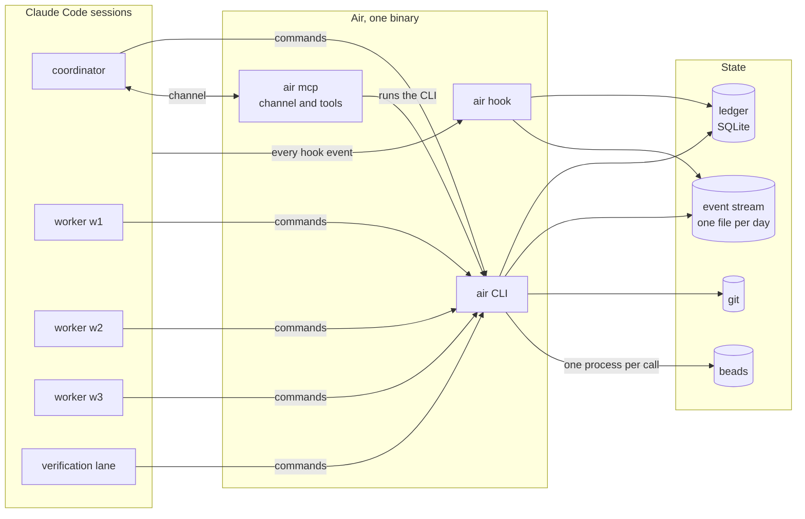
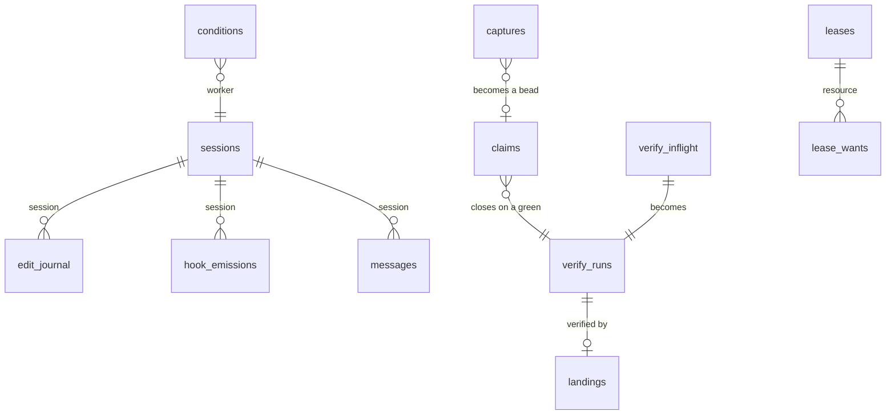
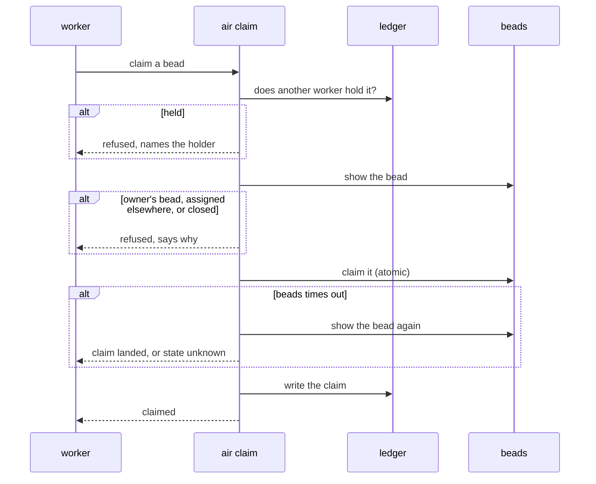
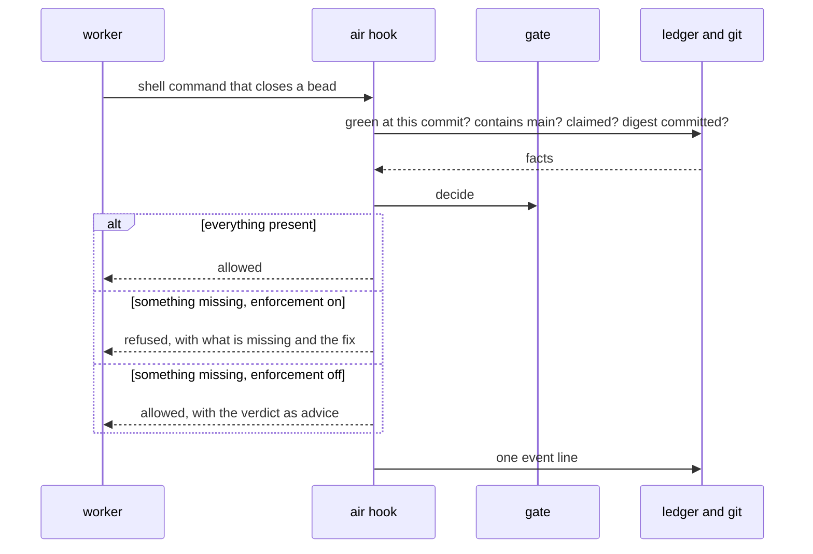
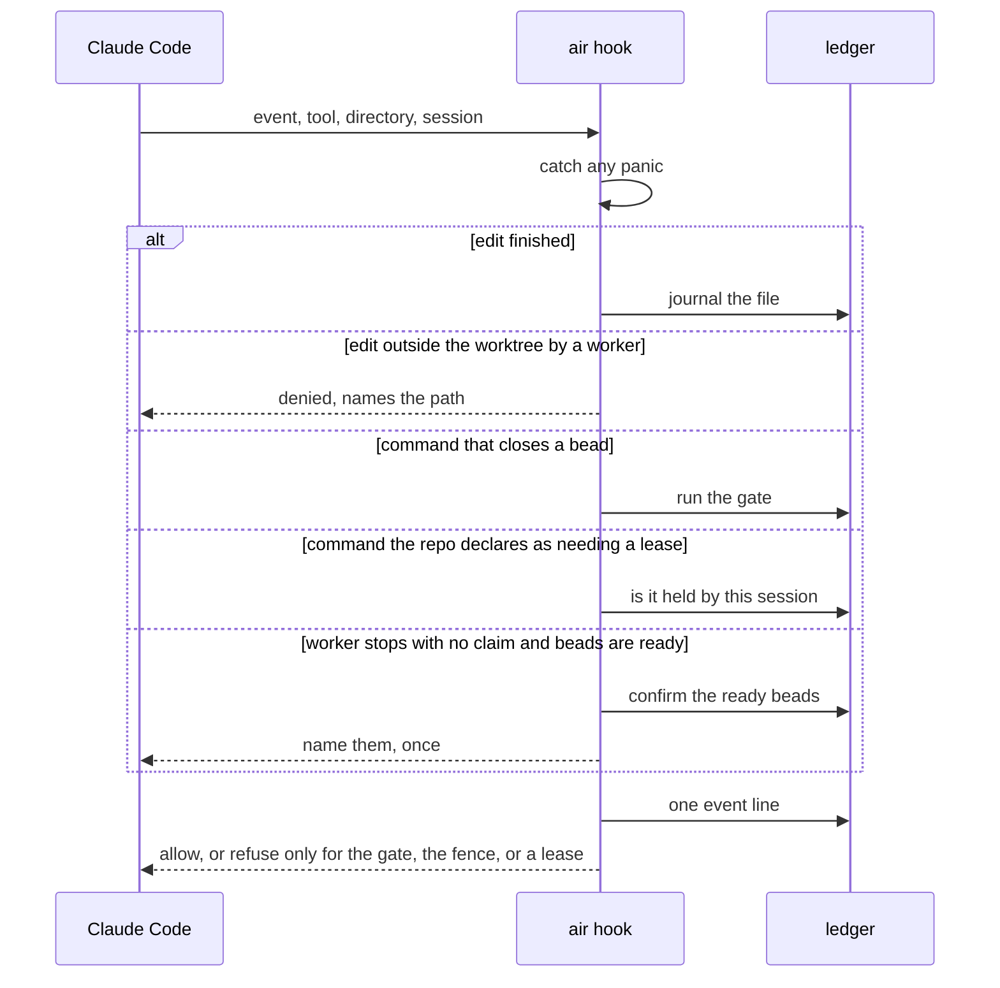
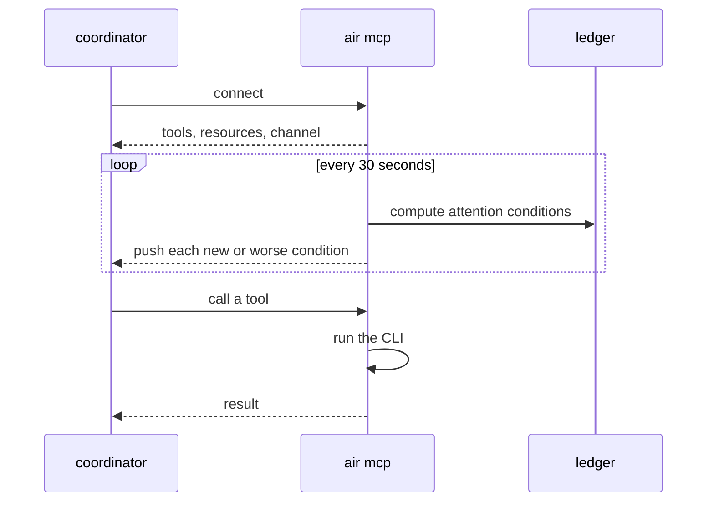
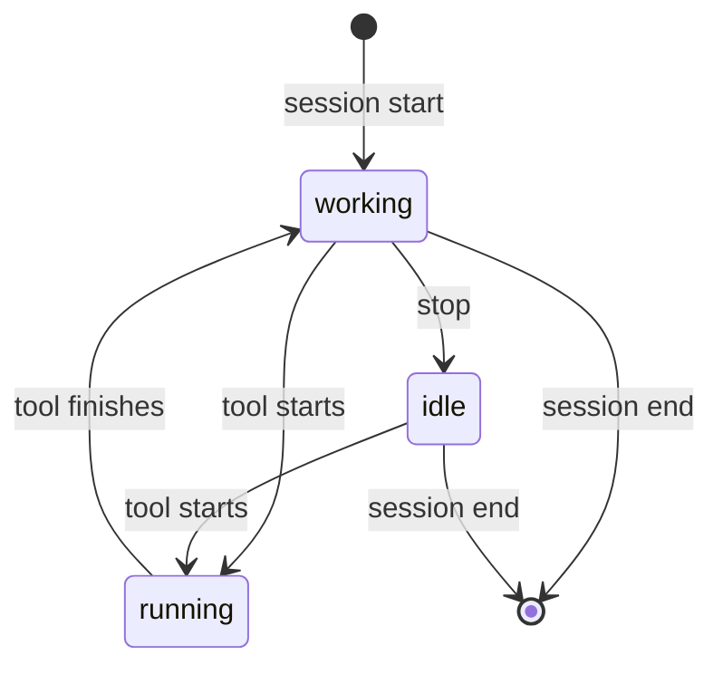

# Air design

Air is a single Rust binary that lets a few Claude Code agents work on one repository at the
same time. Each agent runs in its own git worktree. Air keeps the facts the agents would
otherwise pass around in chat. It knows which commit passed verification, who is editing which
file, who holds which task, and who holds a shared resource. It refuses exactly one thing:
closing a task without a recorded green verification run at a commit that contains main.

This document describes the tree on 2026-09-14: commit aba00d8, version 0.3.5, plus the
change that day that moved every permission decision to the launcher's role. The numbers came
from commands run against that tree.

## 1. Context and goals

A fleet is five sessions: three workers, a verification lane, and the coordinator. The workers
and the lane each live in their own worktree on their own branch. The coordinator still runs
in the main checkout today. All five share one task store, called beads, and one main branch.

Without a shared record, agents relay facts from memory. One says its branch is green, another
says nobody is in a file. Those relays drift, and most of the incidents in the decisions log
trace back to that drift. Air holds the facts where every session can read them. It answers
questions about them quickly enough to run inside an editor hook. Everything it produces is a
fact or an answer, apart from the one refusal. The owner can watch and type into every session,
and nothing Air launches runs headless.

Air does not choose or split the work. It does not review code. It does not run verification
itself; it runs the repository's own command and records the result. It does not replace beads
or Claude Code, and it never pushes, deploys, or publishes.

## 2. Overview



The sessions are ordinary interactive Claude Code processes. Air starts each one with a role, a
list of commands it may not run, and a few environment variables. Sessions reach Air in three
ways. They run air commands from their shell. Claude Code calls the air hook on every tool call
and lifecycle event, which is how Air sees edits and session changes. The coordinator also has
Air attached as a channel, so conditions that need attention arrive without anyone polling.

All three entry points are the same binary, and they write to the same two stores in the main
checkout. The ledger holds current state and the event stream holds history. Air reads git and
beads through their own commands and never copies them. It records only what those two cannot
reconstruct.

## 3. Components

The workspace has four crates. Line counts are from 2026-09-14.

| Crate | Lines | What it does |
|---|---|---|
| ledger | 3,547 | The SQLite schema, one row type per table, and the event writer. It makes no network calls and never calls beads. |
| hooks | 1,342 | The hook input and output types, the hand-over gate, the edit journal, the worktree fence, and the nudge a claimless worker gets when it stops. The gate is a pure function of a set of facts, so it can be tested without git or a clock. |
| bd | 493 | A wrapper over the beads command line: list ready work, show, claim, set status, comment, close. It also counts time spent waiting on beads. |
| cli | 34,620 | Every command, the hook entry point, the channel server, the launchers, install and init, status and its attention conditions, landing, audit, and the self-test. The self-test file alone is 12,899 lines. |

The ledger is one SQLite file under .air in the main checkout, shared by every worktree. A row
stays until the thing it describes stops being true, and nothing expires on a timer. Beside it,
the event stream gets one line per command and per hook call. Each line says what Air was asked,
what it decided, why, and what it looked at.

The hook reads Claude Code's JSON from standard input and must finish within the five second
timeout the installer sets. It fails open. Any error or panic lets the tool call proceed and
writes an event line saying what happened. The hook never calls beads, with one exception: the
stop nudge checks its cached list of ready beads against beads before naming one.

Each command lives in its own source file, with a header naming the incident it exists for and
when it should be removed. Every command writes one event line and can print JSON. The channel
server runs the CLI with JSON output, so the two can never disagree.

The channel server is a small synchronous JSON-RPC server over standard input. Every 30 seconds
it re-reads the attention conditions from the ledger and pushes any that are new or worse. It
lives as long as the coordinator's session, so it limits line length, puts a time limit on every
child process, catches panics per request, and exits cleanly when its input closes.

The worker launcher creates a worktree under .claude/worktrees on its own branch. It copies in
the ignored files the repository lists, such as environment files. It writes any first task to a
file rather than the command line, then starts Claude Code in the worktree with the role prose,
the deny list, and the role's environment. When asked, or when run from a session without a
terminal, it starts a detached tmux session named after the project and the worker. The
coordinator launcher starts Claude Code in the main checkout with the channel attached.

### 3.1 Roles and permissions

Every permission comes from the AIR_ROLE environment variable, which only the launchers set.
The worker launcher sets it to worker and the coordinator launcher sets it to coordinator. A
shell Air did not start has no role, and Air treats it as the owner, who may do anything. A
value Air does not recognise counts as a worker.

The directory a command runs in never decides what it may do. Neither does the repository path
passed on the command line. The coordinator can therefore move into a worktree and keep every
permission it has. The directory still names things, such as which worktree a verification run
belongs to, but it grants nothing.

Workers are kept from a small set of commands in two ways. Claude Code's deny list stops them
from running the commands at all. Air's own checks refuse the same commands again when AIR_ROLE
is worker, which covers the command being spelled a different way.

## 4. Interfaces

### 4.1 Commands

Any session may run these.

| Command | What it does |
|---|---|
| air record | Runs a check command and records the worker, the commit, the exit code, the duration, the output size, and whether the tree was dirty. It refuses a backgrounded command. A check killed by a signal counts as no verdict, not as a failure. |
| air handover | Says what the gate would decide about this worktree right now, and which command would fix anything missing. |
| air claim | The only way to claim a bead. It checks the ledger, asks beads about the bead, claims it in beads, then writes the ledger row. If beads times out, Air reads the bead again instead of guessing. |
| air release | Returns a bead in progress to open. It never reopens a closed bead. The coordinator can release a claim held by a worker that has gone. |
| air capture | Puts one item in the coordinator's inbox. It never blocks. |
| air holdings | Shows who has edits in which files across all worktrees. |
| air lease | Takes, releases, or reports a named shared resource such as a port. The holder is identified by worktree and process. `air lease needs "<cmd>"` says which lease a command needs, per `leases` in `.claude/air.json`; the PreToolUse hook refuses such a command from a worker not holding it. |
| air status | The one screen: sessions, claims, greens, overlapping edits, inbox, branches ready to batch, verifications running, and whether the install is out of date. |
| air doctor | Reports where the ledger is, its size and schema version, and whether beads is the pinned version. |
| air audit | For each mechanism Air ships, how often it fired, over what, when last, and its removal condition. It gives facts, not verdicts. |
| air selftest | Runs a red and a green probe for every check. There are 152 probes today. |
| air gc | Reports how much of the event stream a retention period would remove, and removes it only when told to. |

Workers may not run these. Air refuses them when AIR_ROLE is worker, wherever they are run.

| Command | What it does |
|---|---|
| air inbox | Lists open captures, oldest first. |
| air triage | Resolves one capture, either by linking the bead the coordinator filed or by dropping it with a reason. |
| air land | Builds a commit from the branch's tree on top of main and moves main forward to it. It refuses unless the branch contains main and has a green at its head, and it refuses while any verification is running. It records the beads the branch's commits name. It closes nothing, and it always updates main in the main checkout, wherever it is run from. |
| air close | Closes beads that have already landed, in one beads process, and releases their claims. |
| air worker | Starts a worker session, or prints the command it would run. It can also remove a worktree, but not while the worktree has uncommitted work or a live session. |
| air coordinator | Starts the coordinator session. |
| air install | Adds the hooks and the channel server to the repository's Claude Code settings and writes the role prose. It shows the change first and writes only when told to. It refuses when the air on the path is a different binary, when .air is not ignored by git, or when the repository was installed by a newer version. |
| air init | Sets up a new repository: checks for beads and Claude Code, initialises git and beads, writes the ignore file and Air's config, then installs. |

Two hidden commands, release-check and adopter-check, are run by the Makefile. Claude Code
itself starts air mcp and air hook.

For a sense of real use, here are the counts from an adopter's event stream over 17 days of
rounds, from 2026-08-21 to 2026-09-13. Status ran 4,265 times, claim 1,208, triage 924, capture
842, record 838, handover 506, land 222, holdings 173, lease 122, release 71, close 59, and audit
3. There were also about 148,000 hook events and 44,769 channel polls. This repository's own
counts are not a guide, because Air has mostly been built here rather than used. Usage is one
signal for the audit in section 10, not the verdict.

### 4.2 Channel tools, resources, and conditions

The channel server offers 13 tools and 5 resources. The tools cover status, attention, holdings,
hand-over, claim, release, capture, inbox, triage, close, and taking, releasing, and reporting
leases. The resources cover status, attention, inbox, holdings, and leases. Every one of them
runs the CLI.

The channel pushes nine attention conditions. Each is computed from the ledger, the clock, and a
set of thresholds, with no git involved.

| Condition | Meaning |
|---|---|
| idle with claim | A worker holds a bead and has been idle past the threshold. |
| silent with claim | A worker holds a bead and its session has written nothing for a while. |
| gone with claim | A worker holds a bead and its process has gone. |
| idle without claim | A worker is idle with nothing claimed while beads are ready. |
| handover not green | Someone tried to close a bead without the green the gate wants. |
| landed not closed | A bead's commits are on main but the bead is still open. |
| landable | A branch is green and contains main. |
| lease held by dead session | A shared resource is held by a process that has gone. |
| lease stale | A shared resource's holder has not refreshed it in time. |

### 4.3 Hook events

Installing Air registers the hook on ten Claude Code events, each with a five second timeout.

| Event | What happens |
|---|---|
| Session start and end | The session's row is created or removed. |
| Before a tool runs | For an edit, Air warns if another worker is editing the same file. If the session's role is worker and the file is outside its worktree, the edit is denied. For a shell command that closes a bead, the gate runs; it refuses only when enforcement is on, which the worker launcher turns on. For a message to another agent, Air records the message and its content. |
| After a tool runs | The edited file goes in the journal and the session is marked working. |
| Tool failure, permission request, permission denied, notification | The session's state is updated and an event line is written. |
| Stop and subagent stop | For a worker, Air adds the gate's verdict when something is missing, and nudges a worker with no claim once, naming ready beads it has confirmed. The verification lane named in the config is not nudged, since it claims no bead. Other roles get nothing. |

Every hook call, including the silent ones, writes one event line.

### 4.4 Files and environment

| Path | Purpose |
|---|---|
| .air/ledger.db and .air/events | The ledger and the event stream. Both must be ignored by git. |
| .air/roles.md | The role prose built into the binary, which every session receives. |
| .air/installed.json | The version and notices this repository has been installed with. |
| .air/ready.json | A cached list of ready beads, used by the stop nudge. |
| .air/tasks | A worker's first task, kept off the command line. |
| .claude/air.json | The repository's config: extra deny patterns for each role, which commands need which lease (`leases`), the verification lane's name, how greens are matched, where digests and journals live, and whether Metis is attached. |
| .claude/settings.json and .mcp.json | The hook entries and the channel server entry, merged in by install. |
| .claude/worktrees | One worktree per worker. |
| .worktreeinclude | Ignored files to copy into new worktrees. |

The launchers set four variables on each session. AIR_ROLE is the role. BEADS_ACTOR is the
worker's name, AIR_PROJECT is the project, and AIR_ENFORCE turns the gate from advice into a
refusal for workers. Other variables override where Air finds Claude Code, beads, and tmux, and
change its timeouts and polling interval.

This is the worker launch, as the launcher prints it for a worker named w9 in this repository:

```
AIR_ROLE=worker BEADS_ACTOR=w9 AIR_ENFORCE=1 AIR_PROJECT=air claude
  --append-system-prompt-file .air/roles.md
  --settings '{"env":{...}}'
  --disallowed-tools 'Bash(air land *)' 'Bash(air close *)' 'Bash(git push *)'
    'Bash(bd create *)' 'Bash(bd sync *)' 'Bash(bd update *--claim*)' 'Bash(claude *)'
    'Bash(air worker *)' 'Bash(air coordinator *)' EnterWorktree ExitWorktree AskUserQuestion
```

The coordinator launch attaches the channel and denies only git push.

## 5. Data



| Table | Holds | Written by |
|---|---|---|
| verify runs | One row per recorded check, with the commit, exit code, command, duration, dirty flag, tree, and batch members. | record and land |
| verify in flight | The check currently running and its process. | record |
| edit journal | Which worker touched which file, and when. | the hook |
| claims | Which worker holds which bead, the files it declared, and when it let go. | claim, release, close, the gate |
| sessions | Each session's worker name, role, and state. | the hook |
| landings | Each landing attempt, its result, the beads it carried, and the commit it made. | land |
| captures | Inbox items and what became of them. | capture and triage |
| leases and lease wants | Who holds each shared resource and who is waiting. | lease and the hook |
| hook emissions, conditions, bd cache | What a hook last said in each session, attention conditions with their first and cleared times, and small cached beads answers. | the hook, status, commands that call beads |
| messages | Every message one agent sent another, with its content. | the hook |

On 2026-09-14 this repository's ledger held 214 claims, 157 landings, 145 captures, and 1,176
conditions. Ledger rows never expire. Event files are removed only when the owner runs air gc
with its apply option, and never while the ledger still points at them.

## 6. Flows

### 6.1 Claiming a bead



Air asks the ledger first because it is local and cheap. Beads decides races, because its claim
is the only atomic write. A timeout leaves the state unknown, so Air reads the bead again
instead of trying the claim twice.

### 6.2 Closing a bead, the one refusal



A green means a successful recorded run at the exact commit, or, if the repository matches by
tree, at any commit with the same tree. When a verification lane runs, the lane's green at a
batch commit that contains both the worker's commit and main also counts. That lets workers
close without running verification themselves. A commit made after the batch was cut is refused,
and the refusal names it. A branch is ready for a batch when it is not landable on its own and
names a bead its worker holds; it does not have to contain main, because the lane merges main
in when it cuts the batch.

### 6.3 Landing a branch

```mermaid
sequenceDiagram
  participant C as coordinator
  participant A as air land
  participant L as ledger
  participant G as git
  participant B as beads
  C->>A: land a worker's branch
  A->>A: is AIR_ROLE worker?
  alt worker
    A-->>C: refused
  end
  A->>L: is any verification running?
  alt running
    A-->>C: refused, names the run
  end
  A->>G: does the branch contain main, with a green at its head?
  alt not landable
    A-->>C: refused, names what is missing
  end
  A->>G: build a commit from the branch's tree, move main forward to it
  A->>B: which beads do the commits name
  A->>L: write the landing
  A-->>C: landed, with the beads; nothing closed
```

Main never moves to a commit whose tree was not verified. The landing commit has exactly the
tree the green describes, so there is nothing to re-verify and nothing to roll back. The worker
closes its own bead, before or after the landing. If a bead stays open once its commits are on
main, the landed not closed condition names it.

### 6.4 A hook call



The target is about a tenth of a second per call, so anything slow lives in the CLI instead. If
Claude Code kills a hook at the five second limit, the hook writes nothing. That is why air
audit also counts hook events that have no matching follow-up.

### 6.5 The coordinator's channel



### 6.6 Session states



Status adds two more states. A session is gone when its process disappeared without ending, and
a worktree has no session when nothing has run there. A stuck state for sessions waiting on a
permission prompt used to exist. It was removed because, in auto mode, the permission request
event never arrives.

### 6.7 Timing budgets

Every wait Air takes records how long it lasted and whether it hit its limit, and air audit
prints the distribution. Calls to beads get ten seconds. The status tick, acceptance reads, the
claim check, and the stop nudge get shorter limits. All of those fail closed, which means the
caller is told and nothing is assumed.

Three budgets fail open, because they sit on the hook path: git gets a second and a half, the
SQLite lock gets one second, and the hook itself gets five seconds. Claude Code enforces the last
one by killing the process, so hitting it leaves no trace except a hook event with no follow-up.
With the fleet running on 2026-09-06, git took 54 milliseconds at the median and 170 at the 99th
percentile. The SQLite lock waited at most 131 milliseconds with six writers.

## 7. Guarantees and failure model

| Always true | Enforced by | A violation shows up as |
|---|---|---|
| A bead closes only with a green at a commit that contains main and every commit naming the bead. | The gate, with enforcement on for workers. | A handover not green condition. |
| Main moves only forward, onto a commit whose tree has a green. | air land. | A commit on main with no verification run. |
| One worker holds a claim at a time. | The ledger check, then beads' atomic claim. | Two open claims for one bead. |
| A worker's edits stay inside its worktree. | The fence in the hook. | A denied edit in the event stream. |
| A worker runs a command the repo declares as needing a lease only while it holds that lease. | The lease gate in the hook, refusing for workers and advising the coordinator. | A lease-refuse or lease-would-refuse event. |
| Permissions come from AIR_ROLE and never from the directory or the repository path. | Every role check reads the role from the environment. | A self-test probe going red. |
| Workers cannot push, file beads, land, close, start sessions, or ask the owner a question directly. | Claude Code's deny list, backed by Air's role checks. | A permission denied event. |
| Every command and hook call leaves one event line. | Each command's logging and the hook's fail-open path. | A hook event with no follow-up. |
| A check that finds nothing says what it looked at. | A rule for every check, probed by the self-test. | A green with nothing examined. |
| Adopting repositories are told about every change that affects them. | A notice list, one release per round, and a release check. | The verify target failing. |

When something fails, Air behaves as follows. The hook fails open on any error and on the five
second kill, because it must never block the editor. The kill is silent, so it is measured by
unmatched events. A beads timeout during a claim is treated as unknown and the bead is read
again. A killed verification is recorded as no verdict.

Everything else fails closed and says why. Landing refuses while a verification runs, unless
the owner overrides it, and the override is counted. A worker is refused landing and closing
wherever it runs. A repository path outside this project is refused. Install refuses a downgrade, a .air directory that git does not
ignore, or a different air binary on the path.
Doctor and init refuse a missing or wrong version of beads.

The close gate is the only closed default an agent meets in normal work. Everything else is a
fact, advice, or a refusal that names the command to fix it.

## 8. Enforcement and judgement

Air enforces a short list. The deny list decides who may run what, and the role checks back it
up. Claims are atomic and their history is recorded. A shared resource has one live holder.
Closing a bead needs a green, main merged, a claim, and a committed digest. A verification run
is recorded honestly, with its duration, output, dirty tree, and any change to its command. Air
records who edited what. It pushes each attention condition once, and again only when it
changes. The owner's decisions are beads with the owner label. Main only moves onto a verified
tree.

The agents decide everything else. A capture might become a bead or might not. Agents choose
which bead to take and which resources count as shared. They judge whether a diff is good and
whether a verification covers enough. They decide how to split a file, what to do about a
condition, and when to land. The owner makes the owner's decisions.

Some things were considered and deliberately left out, with the rulings in the decisions log:

- a cap on work in progress, which is measured but never enforced
- a stored phase for epics
- automatic retries of a red verification
- headless or looping workers
- claims inferred by watching beads
- integration branches per epic, convoys, formulas, molecules, and a Gas Town style merge queue
- a coded phase machine, a spec and plan and tasks document set, and an AI triage daemon
- automatic prioritisation, timer or GitHub gates, and automatic re-splitting of work

On 2026-08-17 several outside projects were considered and not adopted as dependencies: the
agent client protocol, Symphony's dispatcher, Vibe Kanban's executors, pueue, Codex's app
server, and an Air daemon. The landscape research has the detail. Some commands were specified
and never built, because no recorded problem called for them: air next, air peer, merge advice,
round metrics, a re-injection before compaction, and a topology file.

The code uses Rust edition 2024 on the latest stable toolchain. Each crate has its own error
enum, and libraries do not use anyhow. Formatting uses the defaults. Clippy runs with warnings
as errors in the verify target. Tests live beside the code, use in-memory SQLite and temporary
git repositories, and never sleep or touch the network. There is no async runtime, and panics
are caught at the hook and server boundaries. These were decided on 2026-08-18, and the Rust
skills have the detail.

## 9. Operations

Install Air with cargo from this repository. In a new repository, run air init. In one that
already uses beads, run air install. Both show their changes first and write only when told to.
Air doctor exits cleanly when the ledger, the schema, and the beads version are right.

Start the coordinator with air coordinator. From that session, start each worker with air worker
and a task. The launcher prints the tmux command to attach to it. Air status is the screen to
watch, and the channel brings the attention conditions to the coordinator.

The verify target checks formatting, runs clippy and the tests, runs the adopter check, and runs
the self-test against the binary it just built. Record a run with air record. A release adds one
row to the release list and sets the same version in the Cargo manifest. Then the release target
refuses a dirty tree or any branch but main, runs the release check and the verify target, and
tags. Rows are only ever added. The last release row is 0.3.5, and four notices are waiting for
the next one.

In a repository, Air writes three tracked files: the Claude Code settings, the channel server
entry, and the role prose. Everything else it writes is ignored by git. That includes the full
text of every agent message since 2026-09-05 and the shell commands in the event stream. Air runs
git, beads, tmux, ps, Claude Code, and the repository's verify command. It contains no network
code.

## 10. TODO

One line per item, with the date it was added and where the detail lives. An item gets a bead id
when it is filed and is deleted when it lands. Rulings go in the decisions log.

Fleet shape, added 2026-09-14:

- [ ] Describe the fleet everywhere as three workers, a verification lane, and the coordinator,
      in every document, prompt, and status line.
- [ ] Air creates every tmux session, including the coordinator's. Today only the worker
      launcher does. (Plan 0009, sections 5 and 9.)
- [ ] The coordinator works in its own worktree, and nobody works in the main checkout. Its
      permissions no longer depend on the directory, so this is now a launcher change. The
      worktree module's header still says Claude Code's worktree isolation is used, and it is
      not. (Plan 0009, sections 1 and 9.)
- [ ] The verification lane lands, and landing is refused to every other role. (Plan 0009,
      section 5.)
- [ ] Before cutting a batch, check each pair of branches for conflicts with git merge-tree,
      and record a dropped branch as a fact. That way typing order never decides a conflict.
- [ ] Record the failing step on every red run. An adopter's ledger has 142 reds with none.
- [ ] Measure how long branches wait to be batched, and show it in status.
- [x] The verification lane key in the config is read by no code. Either read it or remove it.
      The stop nudge reads it, to leave the lane alone (2026-09-25).
- [ ] Prove with a test that a bead can close after its commits land on main. Then drop the
      adopter's rule to wait for every close before landing. (Plan 0009, section 10.)
- [ ] Rewrite the roles text for the five-session fleet, along with the launcher change. It
      ships to adopters, so it needs a notice. Partly done 2026-09-25: the roles text now
      carries the whole protocol (closing, the lane's loop, landing), with notices; the
      coordinator-in-a-worktree and lane-lands parts wait for the launcher.
- [ ] Keep the adopting guide current and condense it lightly.
- [ ] The fleet starts from the coordinator. The owner starts only the coordinator and asks it to
      set up the fleet, which by default starts three workers and a verification lane, each in
      its own worktree and tmux session. The same launches stay available as air commands the
      owner can run by hand. (Owner, 2026-09-14.)
- [ ] A launch command for the verification lane, alongside the worker and coordinator
      launchers. It sets the lane's role, so the lane can land and nothing else can.
- [ ] Update the README's quick start once the coordinator sets up the default fleet on request.
- [ ] On a fresh repository, air init proposes Metis as on and then warns that Metis is not
      installed. Default it to off unless Metis is found. (Seen running the quick start,
      2026-09-14.)
- [ ] On a fresh repository, air doctor reports two expired dated rules and says to delete their
      fallbacks. Delete them, since both expired on 2026-08-23. (Same run.)

- [ ] A verify whose tracked tree or HEAD changed between start and exit records a green for a
      tree that never existed; `air record` checks the tree only at the start. Flag it the way
      a dirty start is flagged, as a measurement, not a refusal. An adopter's worker edited a
      tracked file during its own precheck an hour after citing the rule (2026-09-07).

Surface audit, added 2026-09-14:

- [ ] Audit every command and channel tool. For each, record what it is for, the incident it
      answers, whether something else already does it, and whether it stays. Usage is a signal,
      not the verdict. Use the adopter's counts in section 4.1, never this repository's.
      Leases are unused here and used by the adopter every round, which is the kind of thing a
      count alone gets wrong.
- [ ] Cut the source comments down to what a maintainer needs: what a piece is responsible for,
      its invariants, and its contract. Incident stories move to the decisions log. Go crate by
      crate and run verify after each. The self-test file alone is 12,899 lines.
- [ ] Settle the digest directory. This repository does not set it, so the digest check is off
      here, while CLAUDE.md says it is enforced.
- [ ] Still owed from 2026-08-29: the do-less questions answered for each mechanism, the
      failure-direction question for each place Air parses text, a sentence-level pass over
      the roles text, and the multi-agent question once coordination traffic is measured.

Docs:

- [ ] Rewrite plan 0009 and the system design skill in this document's voice.
- [ ] Refresh the Claude Code facts. The inventory is from version 2.1.241, and 2.1.272 is
      installed.
- [ ] Turn the two findings indexes about the adopter into beads.

## 11. Glossary

| Term | Meaning |
|---|---|
| bead | One task in beads, the task store. |
| claim | The ledger's record that a worker holds a bead. |
| coordinator | The session that triages, files, prioritises, and lands. |
| worker | A session in its own worktree that claims, implements, and closes beads. |
| verification lane | The session that verifies batches of the workers' branches. |
| owner | The person running the fleet, and any shell Air did not start. |
| role | The value of AIR_ROLE, set by the launcher. It decides what a session may do. |
| worktree | A separate checkout of the repository on its own branch, one per worker. |
| main checkout | The repository's own directory, on main, where the ledger lives. |
| green | A successful recorded verification run at a commit, a tree, or a batch. |
| batch ready | A branch that contains main, names a bead its worker holds, and has no green yet. |
| landing | Moving main forward onto a verified tree. |
| digest | A worker's committed note for a bead, naming the bead. |
| capture | One item in the coordinator's inbox. |
| lease | Exclusive use of a named shared resource. |
| condition | One of the nine attention conditions. |
| notice | An entry telling adopting repositories what changed. |
